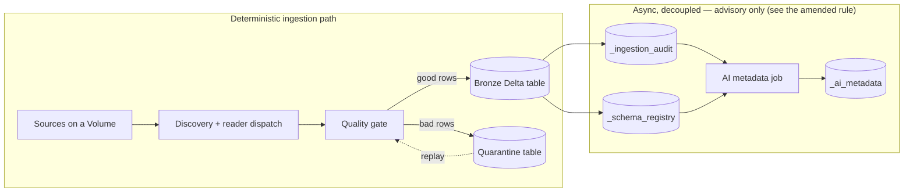

# Bronze ingestion architecture

Target-state design for `bronze_ingest` (`bronze_layer/`): today's shipped
bronze layer, the multi-format ingestion it's built to grow into, and the
AI-assisted metadata layer planned on top of it. Decisions here carry their
reasoning and the alternatives that were rejected, not just the outcome —
that's deliberate, and it's why this document stays long even after a pass
for readability.

**Companion docs:** `docs/overview.md` for a plain-language summary of the
same architecture aimed at non-engineers; `docs/roadmap.md` for what order
this gets built in and why; `docs/bronze_silver_contract.md` for exactly
what Bronze hands Silver;
`docs/decisions/2026-08_autonomous_remediation.md` for the bounds on the
one approved exception to the rule governing the AI lane, below.

## At a glance



Two lanes, deliberately isolated from each other:

| Lane | What it does | Character |
| --- | --- | --- |
| **Deterministic ingestion** | Discover files → read → quality gate → write Delta, with lineage and audit columns on every row | Synchronous, config-driven, no AI, no external calls |
| **AI-assisted metadata** | A separate scheduled job reads the audit trail and schema registry, drafts PII flags / drift summaries / descriptions | Asynchronous, advisory-only, human-reviewed before anything it writes affects the catalog — plus one bounded write-path exception, amended below, whose eligible set is currently empty |

**The one rule that governs the second lane — amended 2026-08-07.** As
originally written, and still true of everything except one clause:

> **The one rule that governs the second lane:** it never sits in the write
> path and never gates an ingestion decision. Acceptance, rejection, and
> quarantine are decided exclusively by `quality.py`, deterministically. If
> a future proposal would have an AI model decide whether a row is
> accepted, that's a different, bigger decision this document does not make
> — see `docs/business_requirements.md` BR-001 for a live instance of that
> question being asked.

That question got asked, and it got answered. On 2026-08-07 Yash (Project
Lead) decided that BR-001's *"AI agents ... suggest fixes"* means autonomous
remediation rather than advisory-only. The reasoning — and the fact that
this conflict was stated to him in exactly these terms before the decision
was made — is recorded in `docs/business_requirements.md` ("Decisions —
2026-08-07"). **"Never sits in the write path" is therefore superseded, with
conditions. Nothing else in the paragraph above is.** In particular, the
"different, bigger decision" it anticipated — an AI deciding whether a row
is accepted — remains unmade, and is now an explicit prohibition rather
than an open question.

The conditions are not restated here, because a bound maintained in two
documents drifts. They live in
`docs/decisions/2026-08_autonomous_remediation.md`, which is the
authoritative statement of how far this exception reaches and is **draft
pending Yash's explicit, named sign-off** — no autonomous-execution work
may start before that. What follows quotes it.

**The eligible set is empty, and that is the finding, not a placeholder.**
The record's §3 verdict, from the evidence gathered for it: *"There is
therefore **no fix class today that is both mechanically fixable and an
actual remediation**. The intersection is empty, and the eligible set is
its intersection."* A class enters only through §3's seven-condition
promotion gate — *"**None. The eligible set starts empty**, and a class
earns entry through the promotion gate in §3 — a gate whose first use is a
Tier 2 sign-off, not an engineering judgement call."* So nothing in this
package remediates autonomously today, and nothing will until a specific
class has been promoted by name.

**What a promoted class may reach is a ceiling, not a default.** §2 bounds
the outer surface — `_ai_metadata`, file placement within a source dir's own
`quarantine_files/`, retry-state entries under `_state/`, and a named
allowlist of `IngestionConfig` fields whose worst case is a re-run — and is
explicit that reaching it is not automatic: *"Only the ceiling in §2, and
only the subset of it that a promoted class names. Nothing is in scope by
virtue of not being forbidden."*

**The quality gate's verdict did not move, and the separation is
load-bearing.** §2's NEVER list, item 2: *"Yash's decision reverses 'the AI
never sits in the write path.' It does **not** make the AI the arbiter of
whether a row is acceptable. These are separable, and separating them
explicitly is load-bearing, because conflating them is precisely how a
bounded exception silently becomes an unbounded one."* Acceptance,
rejection and quarantine remain `quality.py`'s alone, deterministically,
exactly as the superseded paragraph says. Also on that NEVER list, and so
outside this exception entirely: `_ingestion_audit` and `_schema_registry`
(both **Fact**, below), business column values in a bronze row, any delete
against any table, any Tier 2 or Tier 3 action under
`docs/agent_governance.md`, any config field that redirects where data is
read from or written to, the safety mechanisms themselves, and anything
outside the bronze layer.

**None of the machinery this exception depends on exists yet.** The kill
switch (§4) and the rollback path (§5) each carry the same verdict — *"Does
not exist and must be built."* — and the remediation record (§6) must
**fail closed**, deliberately inverting this codebase's convention for
advisory surfaces: *"the audit trail must never fail the ingestion it
observes; the remediation record must always fail the action it
authorizes."* The record's own one-sentence summary is the honest state of
this exception today: *"autonomous remediation currently has nothing safe to
do and none of the machinery it would need to do it safely, so #209's
realistic first deliverable is the safety harness shipped with an empty
eligible set."*

**Why this is amended as an exception with an edge, rather than rewritten
into a rule that permits writing.** Restating the lane as "the AI may write,
within bounds" was the tidier option and it was rejected: a reader arriving
later would see a principle that had eroded, with no way to tell it had been
deliberately overridden, by whom, or on what terms — and the terms are the
entire content of what was approved. The decision record makes the same
argument about itself, *"An exception with no stated edge is not an
exception — it is a repeal that nobody wrote down"*, and its §7 states the
relationship to this document in one line: *"this record is the documented
**exception** to its one rule, of stated shape, not a repeal."*

---

## Status of each piece

| Piece | Status |
| --- | --- |
| JSON bronze ingestion, quality gate, quarantine, retries | **Shipped** |
| Directory ingestion (folder-as-table, archival, retry-limit-before-quarantine) | **Shipped** |
| Run-level audit trail + schema registry | **Shipped** |
| Multi-format ingestion (CSV/XML/Parquet) | **Designed below, not built** |
| Schema registry as AI-layer input | **Shipped** (registry); AI layer **not built** |
| AI-assisted metadata layer (advisory) | **Designed below, not built** — gated on schema registry, which is done, so this can start. Unaffected by the write-path exception, and explicitly not gated on it |
| Autonomous remediation (the write-path exception) | **Not built, and blocked.** `docs/decisions/2026-08_autonomous_remediation.md` is draft pending the Project Lead's named sign-off; its eligible fix-class set is empty, and the kill switch, rollback path and fail-closed remediation record it requires do not exist |
| Silver layer | **Not built** — see `docs/bronze_silver_contract.md` for what it will be handed |

## Multi-format ingestion

**Rule: `source_format` in `IngestionConfig` decides both what's discovered and how it's read** — one config value, two consistent effects:

```
source_format: json     ->  discovers .json, .jsonl   ->  json_reader
source_format: csv      ->  discovers .csv            ->  csv_reader
source_format: xml      ->  discovers .xml            ->  xml_reader
source_format: parquet  ->  discovers .parquet         ->  parquet_reader
```

- **Files of other formats are invisible**, same as `notes.txt` is invisible
  to JSON discovery today — not an error, the existing behavior generalized.
- **Mixed-format folders aren't supported.** Two configs pointing at the
  same path is clearer than implicit per-file routing.
- **Format is never inferred from the file extension**, even though that
  would need less config. Rejected because it would silently ingest a
  `.csv` that today sits harmlessly beside `.json` files — the same class of
  surprise as a stray fixture folder getting auto-ingested (recorded in
  `testing_directory_ingestion.md`'s history). Explicit configuration
  beats implicit discovery here.
- **`multiline` (JSON only) *is* inferred per file, and that's not a
  contradiction.** `source_format` controls which files get pulled in at
  all — getting it wrong means unexpected data, which is recoverable and
  noisy. `multiline` controls how an already-selected file is parsed —
  getting it wrong on a `.jsonl` file silently returns one row instead of
  thousands, with no error. Inference is fine where the failure mode is
  loud; it's rejected where the failure mode is silent data loss.
- **Everything downstream of the reader is already format-agnostic** — the
  quality gate, audit columns, retry logic, archival, and audit trail all
  operate on a DataFrame and need no changes for this to ship.

## Metadata: three tables, facts kept separate from opinion

| Table | Contains | Written by | Trust level |
| --- | --- | --- | --- |
| `_ingestion_audit` | One row per run: status, row counts, timings, errors | Pipeline, synchronously | Fact |
| `_schema_registry` | One row per table: current schema, fingerprint, last-changed | Pipeline, synchronously | Fact |
| `_ai_metadata` | Drafted interpretations, PII flags, descriptions | AI layer, asynchronously | Advisory |

This split makes "AI output is advisory, never authoritative" true by
construction: **nothing in the write path ever reads `_ai_metadata`.** The
registry answers "did the schema change, and to what?" — cheap and factual.
The AI layer answers "what does that change probably mean, and should
someone care?" — commentary built on top of the registry's output, never a
replacement for it.

**The write-path exception does not move any table across this split.**
`_ai_metadata` stays **Advisory**, and nothing in the write path reads it —
the exception permits a promoted fix class to *write* `_ai_metadata`, since
it sits on §2's ceiling; it does not make anything downstream treat what it
finds there as **Fact**. `_ingestion_audit` and `_schema_registry` stay
**Fact** and are on the NEVER list, for the reason the decision record gives:
*"If the remediator can rewrite facts, the audit trail stops being evidence
of what happened and becomes evidence of what something decided should have
happened."* A remediation is recorded somewhere else again — §6 rejects
extending `AUDIT_SCHEMA` and reusing `_ingestion_audit` (one row per
*ingestion* run, and a writer that *"never raises, by design and by
contract"*), and gives the remediation record its own home because it is
*"a record of an **action taken**, and it needs its own home."* That table
is future work, not a fourth member of this split, and when it is built it
must be joinable to `_ingestion_audit` by run identity — without that, *"a
person debugging bad data has no way to discover that anything other than
ingestion ever wrote to that table."*

## How the AI layer runs

**A standalone, scheduled Databricks job** — nothing else. It reads recent
`_ingestion_audit` / `_schema_registry` activity, drafts output, writes to
`_ai_metadata`. Ingestion jobs never call it and never wait on it.

Two mechanisms were considered and rejected:

- **A background thread at the end of the ingestion job** — not actually
  async, since the cluster stays warm until the AI call finishes. A cost
  review already found 96% of this project's Databricks spend is compute
  time; keeping a cluster warm for LLM calls fights that finding directly.
- **Event-driven triggers** — more infrastructure for a workload nobody
  needs within seconds of ingestion. Nothing here is latency-sensitive.

**Failure handling, consistent with the rest of this codebase's failure
story** (retry-with-backoff, quarantine fallbacks, an audit writer that
never raises): a failed or timed-out call logs and skips that table; the
job continues with the rest; there's no aggressive retry, since the next
scheduled run naturally picks up anything still showing as changed;
malformed AI output is discarded rather than written, because a bad row in
`_ai_metadata` is worse than no row.

**Cost is bounded by design** — zero AI cost per ingestion run, one
scheduled job amortizing cluster startup across every table it touches,
and only tables with genuinely new activity get reprocessed.

**This section describes the advisory job, and only it.** The remediation
lane approved on 2026-08-07 is a second thing, not a new mode of this one,
and three of the properties above invert for it — which is the clearest
statement available of how much of this design a write-capable AI lane
cannot reuse.

Its failure convention inverts. A failed advisory call logs and skips that
table because its failure costs an observation; every remediation
prerequisite **fails closed** because its failure costs a write, and the
decision record is deliberate about the collision — *"`_write_audit_row`'s
never-raise contract now has an exception in the same codebase, and the two
conventions sit one module apart."* The next person to find them should not
"fix" the fail-closed path into consistency with the fail-open one.

Its control channel inverts. This job's behaviour, like every job here, is
fixed at the moment it starts; the kill switch is required to be *"reachable
without a deploy"* and *"effective mid-flight, between actions"*, which is
why §5 of the decision record names "What's left" item 4 below — control-
table driven dynamic config, **not started** — as a prerequisite for it.

Its isolation from ingestion becomes a guarantee to be built rather than a
property of being decoupled. Pulling the kill switch *"does not stop
ingestion"*: deterministic ingestion continues with remediation disabled,
because *"if pulling the switch also stops data landing, operators will
hesitate at the exact moment hesitation is most expensive."* That is the
two-lane isolation at the top of this document, restated for a lane that can
write. None of it exists, and none of it may be started before the decision
record is signed off.

## Explicitly out of scope: `flatten_mode`

Removed from Bronze entirely. Flattening is a reshaping decision for
downstream consumers — a Silver concern (see
`docs/bronze_silver_contract.md`), not a Bronze one; Bronze preserves
source fidelity. The working `flattener.py` and its tests are archived at
`silver_layer/_archive/` for reuse once Silver is built, not deleted.

## What's built, in delivery order

1. **Bronze core** — config-driven ingestion, quality gate, quarantine, retries, Unity Catalog integration
2. **Directory ingestion resilience** — per-file failure isolation, automatic archival, retry-limit-before-quarantine, folder-as-table merging
3. **Enterprise-hardening phase 1** — run-level audit trail wired into every ingestion path, CI enforcement with branch protection

## What's left, in dependency order

**Enterprise hardening, remaining:**

| # | Item | Status |
| --- | --- | --- |
| 4 | Control-table driven dynamic config | Not started |
| 5 | Concurrency locking (#153) | Job-level done (`max_concurrent_runs: 1`); library-level (two direct callers racing on one `source_dir`) still open |
| 6 | Config validation and allowlist governance | Substance tracked in #154/#54, not implemented |
| 7 | Secrets via Databricks secret scopes (#115) | Not started, blocked on #112 provisioning |

**Target-state build, in the order each piece unblocks the next:**

1. **Schema registry** — cheapest, unblocks the most (AI drift summaries need schema history to exist first). **Done.**
2. **Multi-format ingestion** — independent of the AI layer, can run in parallel with it.
3. **AI metadata layer** — depends on the audit trail (done) and schema registry (done) as its inputs. Can start now; this is the advisory layer and is not gated on the write-path exception.

**What Bronze owes Silver**, from `docs/bronze_silver_contract.md`, in dependency order:

1. Change Data Feed enabled on bronze and quarantine tables (#58), paired with a retention floor (#159) — VACUUM deletes CDF history, so shipping one without the other is a guarantee that isn't real.
2. `overwrite` rejected together with CDF at config load — under `overwrite`, CDF emits the whole table as deletes-plus-inserts every run, which is strictly worse than a full rescan.
3. A `layer` column on `AUDIT_SCHEMA` — decided now because deciding it after #62's dashboard exists would mean rebuilding the dashboard.

Silver's own build isn't scheduled here — see `docs/roadmap.md`. Its
gating prerequisite is "§5 of the Bronze→Silver contract is answered and
the buy-vs-build call is made," both of which are done
(`docs/buy_vs_build_2026-08.md`: build).

## Measured operational characteristics

Numbers, not impressions — `testing_directory_ingestion.md` owns the
benchmark; this section and the `_archive_files_parallel` docstring both
defer to it rather than carrying an independent figure.

- **Archival costs ~0.45s/file**, and is the dominant linear cost of
  folder ingestion. Irreducible on serverless today: `dbutils.fs.mv` calls
  serialize through the Spark Connect client.
- **100 files/folder ≈ 163s total**, ~45s of it archival.
- **Past roughly 100 files/folder, use Auto Loader** (`ingestion_mode:
  streaming`) instead of folder-as-table — it avoids per-file archival
  entirely. A new source's expected file volume should decide its
  ingestion mode before its format does.

## Open questions

- **CDF retention floor** — `docs/bronze_silver_contract.md` recommends 30
  days; it's the one number there that can't be derived from the code
  (needs to exceed the slowest CDF consumer's lag, and no consumer exists
  yet). Confirm before #58 ships.
- **Buy-vs-build — resolved**, not open. `docs/buy_vs_build_2026-08.md`
  verdicts every framework feature in the backlog against a real fixture,
  not a README: Silver's rule engine is **build** (DQX can't be
  constructed without an authenticated workspace, which would make the
  322-test local suite unable to cover it); Lakeflow Declarative Pipelines
  is **not adopted** (no equivalent for folder-as-table, per-file
  archival, cross-run retry-limit, or quarantine replay).
