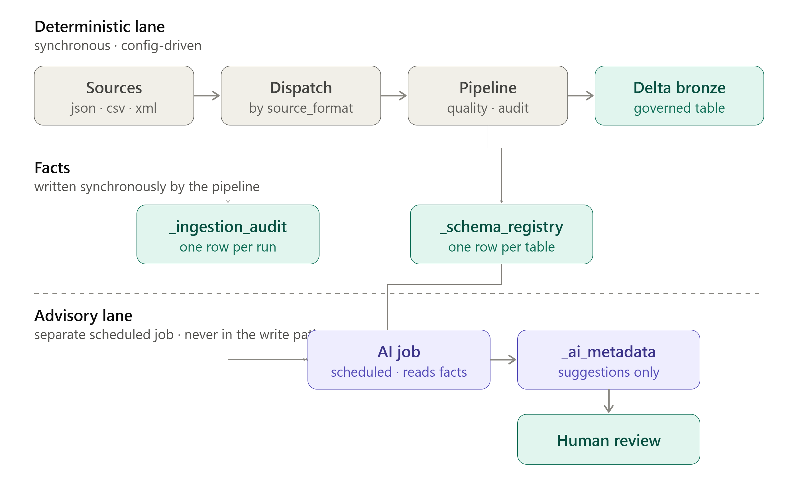

# Target Architecture — Bronze Ingestion Framework with Async AI-Assisted Metadata Layer

## Overview

This document describes the target-state architecture for `bronze_ingest`
(in the `bronze_layer/` folder), extending the current bronze ingestion
pipeline to (a) support multiple source formats beyond JSON, and (b)
incorporate AI-assisted metadata generation — without introducing risk to
the ingestion pipeline's reliability guarantees.



## Architecture Summary

The design is partitioned into two isolated execution lanes.

### 1. Deterministic ingestion path

Sources → format-aware discovery and reader dispatch → existing pipeline
(quality gate, audit columns, write) → Delta bronze table.

Everything in this lane is deterministic, config-driven, and synchronous.
No AI, no external API calls, no non-deterministic behavior.

### 2. Asynchronous AI-assisted metadata layer

A **separate scheduled job**, entirely decoupled from ingestion. Reads
the audit trail and schema registry, generates advisory output (PII
flagging, schema drift summarization, draft column/table descriptions),
and writes to a dedicated metadata table for human review prior to any
catalog update.

## Design Principle

The AI layer is intentionally decoupled from the write path: no shared
transactions, no blocking calls, no gating decisions, and — critically —
**no execution inside any ingestion job**. All AI output is advisory and
routed through human review. Acceptance, rejection, and quarantine
decisions remain governed exclusively by the deterministic quality logic
in `quality.py`.

This satisfies the requirement that AI adoption introduce no bottleneck
or deadlock risk to the core ingestion SLA.

---

## Multi-format ingestion

### Format dispatch: config drives both discovery and reading

`source_format` in `IngestionConfig` determines **which files are
discovered** and **which reader handles them**. One config value, applied
consistently at both stages.

```
source_format: json     ->  discovers .json, .jsonl   ->  json_reader
source_format: csv      ->  discovers .csv            ->  csv_reader
source_format: xml      ->  discovers .xml            ->  xml_reader
source_format: parquet  ->  discovers .parquet        ->  parquet_reader
```

`list_json_files` generalizes to `list_source_files(spark, source_dir,
source_format)`, using an extension map rather than hardcoded
`.json`/`.jsonl`.

**Files of other formats are simply invisible**, exactly as `notes.txt`
is invisible to JSON discovery today. This is not an error case — it's
the existing behavior generalized, and there is already a test asserting
it.

**Mixed-format folders are not supported.** A folder containing both CSV
and JSON needs two configs pointing at the same path, which is clearer
than implicit per-file routing anyway.

**Why not infer format per file from its extension?** It would silently
change existing behavior — a `.csv` sitting beside `.json` files would
suddenly get ingested where today it's ignored. That is the same class of
surprise as the fixture-folder incident documented in
`docs/testing_directory_ingestion.md`, where a test folder left in a real
source directory was auto-ingested unnoticed. Explicit configuration is
preferred over implicit discovery.

**Why `multiline` IS inferred per file, when `source_format` is not.** The
two look like the same decision and are not, so the apparent inconsistency
is deliberate (#146).

`source_format` decides **which files are ingested**. Inferring it can
surprise someone with data they never asked for, and the failure is
recoverable but noisy — a table exists that should not.

`multiline` decides **how a file already selected for ingestion is
parsed**. Inferring it cannot pull in unexpected data; the only thing it
can change is whether a `.jsonl` file yields all its records or just the
first. Getting it wrong destroys data *silently*: `multiLine=true` on
JSON-lines returns one row, with no error and nothing in
`_corrupt_record`.

So the asymmetry follows from the consequences, not from a general
preference. Inference is rejected where the downside is unexpected data
and accepted where the downside is silent data loss. `.json` stays
config-driven in both directions, because it is genuinely ambiguous — it
may be one pretty-printed document or JSON-lines — and only `.jsonl` /
`.ndjson` state their format unambiguously.

The rule is applied per file on the batch path, where discovery
enumerates files and reads them one at a time. Auto Loader cannot work
that way: it is given a directory and a fixed `multiLine` at stream start,
and files arriving later cannot be classified in advance. The streaming
path therefore pairs the same extension rule (for single-file sources)
with a per-micro-batch guard that fails the batch rather than committing a
truncated read — see `streaming_reader.assert_no_silent_truncation`, and
the README's "Streaming and JSON-lines" table.

### What multi-format does not change

Everything downstream of the reader is already format-agnostic — it
operates on a DataFrame. The quality gate, audit columns, retry logic,
archival, retry-limit quarantine, folder-as-table merging, and the
run-level audit trail all work unchanged regardless of source format.

Note that `flatten_mode` no longer exists in bronze (see below), which
removes what would otherwise have been the trickiest cross-format
question — what "auto-flatten" means for an inherently flat format like
CSV versus an inherently nested one like XML.

---

## Metadata: three tables, facts separated from interpretation

| Table | Contains | Written by | Trust level |
|---|---|---|---|
| `_ingestion_audit` | One row per run: status, row counts, timings, errors | Pipeline, synchronously | Fact |
| `_schema_registry` | One row per table: current schema, fingerprint, when it last changed | Pipeline, synchronously | Fact |
| `_ai_metadata` | Interpretations, suggestions, drafted descriptions, PII flags | AI layer, asynchronously | Advisory |

**The separation is deliberate and structural.** The first two record
things the pipeline knows with certainty. The third records opinion,
generated later, never treated as authoritative.

This makes the "advisory only" principle enforceable by construction
rather than by convention: **nothing in the write path ever reads
`_ai_metadata`.**

It also clarifies an overlap that would otherwise be ambiguous. The
schema registry answers *"did the schema change, and to what?"* — cheap,
deterministic, factual. The AI layer answers *"what does that change
likely mean, and should someone care?"* — interpretation, built on top of
the registry's output. The registry is the input; the AI output is
commentary on it.

---

## How the AI layer actually runs

### Mechanism: a separate scheduled job

The AI layer is a **standalone Databricks job on its own schedule**. It
reads recent activity from `_ingestion_audit` and `_schema_registry`,
generates output, and writes to `_ai_metadata`.

Ingestion jobs know nothing about it, never call it, and never wait on
it.

**Why not a background thread at the end of the ingestion job?** Because
that isn't genuinely async — the cluster stays alive until the AI work
finishes, extending job duration and cost. A recent Azure cost review
found 96% of Databricks spend was compute time, so keeping a cluster warm
to make LLM calls is precisely the pattern worth avoiding.

**Why not event-driven triggers?** Meaningfully more infrastructure for a
workload that is inherently non-urgent. Nobody needs a PII flag within
seconds of ingestion.

### Failure handling

Consistent with every other component in this codebase, which has an
explicit failure story (retry-with-backoff, quarantine fallbacks,
retry-limits, archival fallback chains, `_write_audit_row` which never
raises):

- A failed or timed-out LLM call **logs the failure and skips that table**
- The job **continues** with remaining tables — one bad response never
  halts the batch
- **No aggressive retry.** The next scheduled run picks the table up
  again naturally, since it will still show as changed
- Malformed or unparseable AI output is **discarded, not written** — a
  partial or nonsensical row in `_ai_metadata` is worse than no row
- **Ingestion is unaffected in every case**, because it is not in the
  loop at all

### Cost position

Bounded and predictable by design:

- **Not per-ingestion-run.** Ingestion jobs incur zero AI cost.
- **One scheduled job**, amortizing cluster startup across all tables
  processed in that run
- **Only processes what changed** since the last run — tables with an
  unchanged schema fingerprint and no new audit activity are skipped
  entirely, so steady-state cost stays low even as table count grows
- Schedule frequency is the primary cost lever and can be tuned
  independently of ingestion frequency

---

## Removed from scope: `flatten_mode`

`flatten_mode` (with `explode_arrays` and `auto_flatten_threshold`) has
been **removed from bronze entirely**. Flattening is a reshaping decision
about how downstream consumers want data — a silver-layer concern, not a
bronze one. Bronze preserves source fidelity.

The working, tested `flattener.py` and its test suite were **archived to
`silver_layer/_archive/`** for reuse when the silver layer is built,
rather than deleted.

Nested structures now land in bronze exactly as read.

---

## Delivery Sequencing

### Completed

1. **Bronze layer core** — config-driven ingestion, quality gate,
   quarantine, retries, Unity Catalog integration
2. **Directory ingestion resilience** — per-file failure isolation,
   automatic archival, retry-limit-before-quarantine, folder-as-table
   merging
3. **Phase 1 of enterprise hardening** — run-level audit trail
   (`audited_run()` wired into all three ingestion paths) and CI
   enforcement via GitHub Actions with branch protection

### Remaining enterprise-hardening phases

4. **Control-table driven dynamic config** — not started.
5. **Concurrency locking** (#153) — *partly done*. The deployed job sets
   `max_concurrent_runs: 1` with `queue.enabled`, so two runs of the *same
   job* can no longer race on discovery, archival and `_state/`. That is
   the deployment-level half. The library-level half is still open: two
   callers invoking `ingest_directory_to_bronze` against one `source_dir`
   from anywhere else are still unguarded.
6. **Config validation and allowlist governance** — *barely started*.
   #166 rejects unknown keys passed to `ingest_directory_to_bronze`, which
   is the shallowest part of it. The substance is open and tracked in
   **#154** (identifier validation, SQL escaping, `reader_options`
   allowlist) and **#54** (numeric ranges, identifier safety). Neither is
   implemented.

   *(An earlier revision of this list said phase 6 was "partly done via
   #154". That was wrong — #154 is the issue describing the remaining
   work, not work delivered.)*
7. **Secrets via Databricks secret scopes** (#115) — not started; blocked
   on the workspace provisioning in #112.

This list and `bronze_layer/README.md` § "Not yet implemented" describe
the same set of gaps from two angles: this one is phased and
architectural, that one is issue-linked and reader-facing. If they
disagree, the open issues are the tiebreak.

### Target-state work, in dependency order

1. **Schema registry** — cheapest of the three, and unblocks the most.
   AI-driven schema drift summarization has nothing to summarize without
   schema history, so this genuinely must come first.
2. **Multi-format ingestion** — independent of the AI layer; can proceed
   in parallel with the registry if useful.
3. **AI metadata layer** — depends on both the audit trail (done) and the
   schema registry as its input surfaces.

This ordering corrects an earlier version of this document, which placed
the AI layer before the schema registry — an ordering that would have
left it with no drift data to work from.

### Silver, and what Bronze owes it

This list ended at the AI metadata layer and did not mention Silver at all,
which was a real gap: three shipped or planned bronze decisions defer to a
layer that had no design (#162). `#76` archived the flattener "for Silver",
`#109` moved five of seven quality rules "to Silver", and `#58` proposes
Change Data Feed "so Silver can read incrementally".

**`docs/bronze_silver_contract.md` now records what Silver is handed.** It
does not propose building Silver — it decides the interface, so that further
bronze work is not built against an assumption nobody checked.

The bronze-side obligations that fall out of it, in dependency order:

1. **CDF enabled on bronze and quarantine tables** (#58) — with the
   retention floor from #159, since `VACUUM` deletes change history and a
   feature whose data is silently deleted is not a guarantee
2. **`overwrite` rejected together with CDF at config load** — under
   `overwrite` the change feed emits the whole table as deletes plus
   inserts, which makes it strictly worse than a full rescan
3. **`layer` column on `AUDIT_SCHEMA`** — the contract keeps one audit table
   across layers, and deciding that after #62's dashboard exists would mean
   rebuilding it

Silver's own delivery is not scheduled here. #109 remains its first real
task, gated on #163's buy-vs-build answer rather than on the previous
unfalsifiable prerequisite of "Silver has a real pipeline".

---

## Known operational characteristics

Measured, not assumed — see `docs/testing_directory_ingestion.md` for
full benchmark detail.

- **Archival costs ~0.45s per file** and is the dominant linear cost in
  folder ingestion. This is irreducible on serverless: `dbutils.fs.mv`
  calls serialize through the Spark Connect client and do not
  parallelize, confirmed by benchmark.

  The folder-as-table path still submits archival through a 10-worker
  `ThreadPoolExecutor` (`_archive_files_parallel`). That is not a
  contradiction and not stale code: the pool was measured *after* it was
  added and produced no speedup — 163.0s threaded vs 161.3s sequential,
  with files completing in exact input order at ~0.45s intervals, which
  is what serialization in the Connect client looks like from the caller's
  side. It is kept because it costs nothing, is correct either way, and
  would start paying off if a future runtime lifts that serialization.
  The function's docstring says the same; this document and that docstring
  both defer to `docs/testing_directory_ingestion.md`, which owns the
  number.
- **100 files per folder ≈ 163s total**, of which ~45s is archival.
- **Beyond roughly 100 files per folder, use Auto Loader**
  (`ingestion_mode: streaming`) rather than folder-as-table. Auto Loader
  handles high volume by design — incremental discovery, batched
  processing, checkpoint-based tracking — and avoids per-file archival
  entirely.

This sizing guidance matters for multi-format planning: a new source's
expected file volume should determine its ingestion mode before its
format does.

---

## Open questions

Two, both recorded rather than resolved:

**The CDF retention floor.** `docs/bronze_silver_contract.md` recommends
**30 days**, and it is the one number in that document that cannot be
derived from the code — it must exceed the slowest CDF consumer's lag, and
no consumer exists yet. Needs confirming before #58 ships. Tracked in #159.

**Buy-vs-build (#163).** Whether Databricks Labs DQX replaces the silver
rule engine #109 proposes. The contract's §5 decision — that Silver
reimplements rather than sharing `quality.py` — is contingent on the answer.

All previously-open design questions (format dispatch mechanism, metadata
store boundaries, async trigger mechanism, `flatten_mode` across formats,
AI failure handling, cost position) remain resolved and documented above.