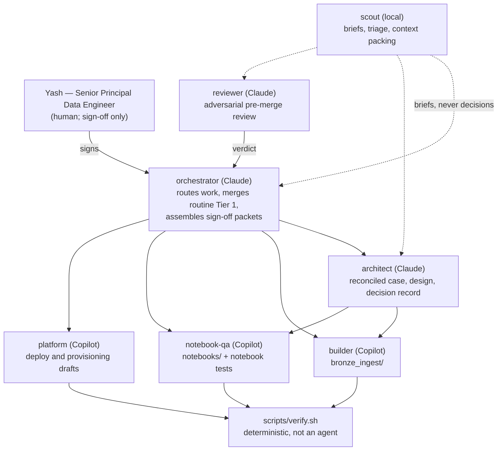

# AI agent governance

Who does what, on which substrate, and what an AI agent may do in this
repository without a human saying yes first.

Written for Yash — Senior Principal Data Engineer on this project, and the
sign-off authority for everything this document doesn't explicitly delegate.
The operating assumption throughout: **Yash signs off; he does not route
work and does not implement.** Every design choice below follows from that.
An agent that generates work for the sign-off queue, or that relays a
decision without making one, is spending the only genuinely scarce resource
here — Yash's attention — and has been removed.

This doc governs *agent behavior*. It doesn't replace `CONTRIBUTING.md` (the
shared contribution workflow) or `AGENTS.md` (general operating instructions
for any coding agent here). Read those first. If this doc and `AGENTS.md`
disagree, that's a bug — fix one of them, don't quietly follow whichever is
more convenient.

**The governing principle:** agents propose, draft, and verify;
`orchestrator` merges routine Tier 1 work on its own; Yash signs anything
that carries judgment, spends money, touches a credential, changes who can
see production data, or moves code toward prod. Nothing below is about agent
*capability* — it's about whose judgment is required, regardless of how
capable the model is.

---

## The four tiers

Tiers bind **by action, not by role and not by substrate.** A deploy drafted
by a Copilot chat mode is exactly as Tier 2 as one drafted by a Claude
subagent. A cheap local model summarising a `GRANT` doesn't make it Tier 0.

### Tier 0 — fully autonomous, no approval needed

- Reading, searching, summarising, and explaining any file in the repo.
- Running `./scripts/verify.sh` and reporting its result.
- Drafting code changes on a local branch or an already-open feature branch.
- Opening or updating a PR **into `dev`** (never merging it, except where
  Tier 1 delegates the merge — see below).
- `databricks bundle validate` (any target) — read-only, resolves config,
  touches no compute or data. It needs an **authenticated profile**
  (`--profile <name>`): it calls `GET /api/2.0/preview/scim/v2/Me`, so
  credential-free it fails for auth on every target and CLI version, which
  says nothing about the bundle. If no profile is authenticated, report the
  check as NOT RUN, not as a failure — that false signal is what #244
  removed from CI, and it's the same rule `scripts/verify.sh` follows.

### Tier 1 — draft freely; merging splits two ways

Tier 1 covers: any PR merge into `dev`; any change to `IngestionConfig`'s
public shape; any change to `.github/workflows/ci.yml`; any suppression of a
ruff/mypy/bandit/pip-audit finding; any change to a notebook or
`bronze_layer/resources/*.yml`.

Within that, merge authority splits on a **mechanical trigger** — never on
an agent's judgment about whether something "feels" significant:

**`orchestrator` merges on its own** when *all* of these hold:

- CI is green, and `scripts/verify.sh` reports no FAILED gate;
- the diff touches none of the escalation paths below;
- the change is a dependency bump, a docs change, added tests, or a
  refactor with no behavior change.

**Yash signs** when the diff touches any of:

- `bronze_layer/bronze_ingest/` in a way that changes behavior;
- `bronze_layer/notebooks/` or `bronze_layer/resources/*.yml` — this repo's
  two known live production defects both shipped through untested notebooks
  (#144, #145), and that history outranks any agent's confidence;
- `IngestionConfig`'s public shape;
- `.github/workflows/ci.yml`, `scripts/verify.sh`, or the write-lockdown hook;
- any new or widened suppression;
- `agents.lock`.

The trigger is path-plus-CI-status, so no agent ever has to decide whether
to escalate — it either matched a path or it didn't. Getting a Tier 1 change
green on `scripts/verify.sh` before asking is table stakes, not a substitute
for the review.

### Tier 2 — draft only; requires Yash's explicit, named sign-off before executing

Not "review the PR afterwards" — these need a yes *before* the action runs,
because several aren't reversible by a follow-up PR:

- `databricks bundle deploy -t staging` or `-t prod`
- Any `GRANT` / `REVOKE` / `DROP` / `VACUUM` / destructive `DELETE` or
  `ALTER ... DROP COLUMN` against Unity Catalog
- Any change to `run_as_service_principal` values, `run_as` blocks, or
  target definitions in `databricks.yml`
- A promotion PR: `dev` → `staging` or `staging` → `main`
- Any Azure portal action in `azure_setup.md` not already checked off there
- Enabling Change Data Feed, changing `VACUUM` retention, or any change with
  a stated irreversible-history consequence (see
  `docs/bronze_silver_contract.md` §1)

An agent hitting a Tier 2 action drafts the exact command/SQL/diff, states
the blast radius (which environment, which principals, what happens if it's
wrong), and stops. This authority does not shift to `orchestrator` or any
other agent.

### Tier 3 — never autonomous, no drafting shortcut

- Creating, rotating, or displaying service principal credentials or any
  secret — including `AGENT_CONFIG_TOKEN`.
- Any IAM/RBAC change in Azure or the Databricks account console, and any
  access-grant change on the private `ingredion-agent-config` repo.
- A hotfix commit directly to `main`.
- Removing or weakening a CI gate or a `scripts/verify.sh` gate. (Adding or
  strengthening one is Tier 1.)

For Tier 3 an agent explains what needs to happen and who must do it — it
never routes around it through a side door.

---

## The team

Seven agents, defined by **function and substrate**, not by an org-chart
metaphor. The previous roster had eleven roles mirroring a corporate
reporting structure; four of them existed to relay work between other agents
or to compensate for a Project Lead who wasn't a working engineer. With a
principal engineer as the sign-off authority, those layers were latency.

| Agent | Lane | Owns | Never |
| --- | --- | --- | --- |
| `orchestrator` | Claude | Routing, Tier 1 routine merges, sign-off packets | Implements; executes Tier 2/3 |
| `architect` | Claude | Business reconciliation, technical design, decision records | Writes pipeline code |
| `reviewer` | Claude | Adversarial pre-merge review on escalation paths | Merges; reviews its own work |
| `builder` | Copilot | `bronze_layer/bronze_ingest/` | Touches notebooks, resources, `databricks.yml` |
| `notebook-qa` | Copilot | `bronze_layer/notebooks/` + `tests/test_notebooks.py` | Touches package internals |
| `platform` | Copilot | `databricks.yml`, `resources/*.yml`, Azure — **drafts only** | Executes any deploy, grant, or credential action |
| `scout` | Local | Briefs, summaries, CI-log triage, routing hints, context packing | Decides anything |

**What was removed, and why.** `business-stakeholder` researched and
proposed business opportunities — an agent that manufactures demand for the
sign-off queue is the worst thing to run when the human's only job is
sign-off. `devops-lead` coordinated two agents and held no authority of its
own. `devops-engineer` ran ruff/mypy/bandit/pip-audit/pytest — deterministic
tools with exact exit codes, now `scripts/verify.sh`; spending a model turn
to run a linter and read its output was waste. `business-analyst` and
`solution-architect` merged into `architect`, because for a solo build the
two-role handoff bought ceremony rather than rigour, and `data-analyst`
folded into `scout` for the same reason. **`docs/business_requirements.md`
survives as a required section of `architect`'s output**, so nothing with
external value was lost, and the role splits back out cleanly if Ingredion
stakeholders ever need it standalone.

**`notebook-qa` stays separate on purpose.** It's the one split in this
roster earned by evidence rather than by tidiness.

---

## Lanes and the dispatch ladder

Three substrates with different economics, so **nothing runs on a rung
higher than it needs**:

| Rung | Substrate | Cost | Use for |
| --- | --- | --- | --- |
| 0 | `scripts/verify.sh`, CI, hooks | free, exact | anything deterministic |
| 1 | local model (Ollama) | free, private, unlimited | bulk reading, extraction, triage |
| 2 | Copilot base model (0x) | free, unlimited | drafting, first-pass review, exploration |
| 3 | Copilot Sonnet (1x) | ~300/month | real implementation |
| 4 | Claude Opus | subscription cap | judgment only |

**Rung 1's hard rule: local output is an index, never evidence.** A small
local model produces fluent, confident, wrong summaries. A `scout` brief
tells an expensive agent *where to look*; it never substitutes for looking.
The moment a decision rests on a local summary being correct, the saving has
become a compromise.

**Rung 4 is for judgment that can't be verified cheaply**: architecture and
design decisions, Tier 2/3 blast-radius assessment, review of the escalation
paths, and security judgment. Moving those down the ladder is not a saving.

**`reviewer` is path-triggered, not always-on.** It runs on Claude only when
the diff touches an escalation path; everything else gets a rung-2 review.
The trigger is mechanical, so nobody has to decide whether a review is
"worth" the budget.

---

## The handoff bus

The three substrates share no memory. Copilot agent mode, Claude Code, and
the local model cannot see each other's context, so any handoff that lives
"in the conversation" is lost the moment work crosses a lane.

**GitHub issues and PRs are the bus.** Not a new state directory — the thing
`AGENTS.md` already mandates ("there should be an open GitHub issue
describing what and why before you start"). It's readable from every lane via
`gh`, it's durable, it's auditable, and it's where sign-off already happens.
Every cross-lane handoff is an issue or PR comment naming the lane that wrote
it and the lane it's addressed to. A handoff that isn't written down didn't
happen.

## The sign-off packet

Yash gets three interrupt types and nothing else. Each arrives complete — an
agent that asks a question without having done the work to make it
answerable has failed at its job.

1. **Design arbitration** — `architect` hit a fork it can't settle from the
   repo's recorded decisions. Packet: the fork, both options with
   consequences, a recommendation, and the decision record it would write.
2. **Tier 1 escalation** — packet: the diff, CI status, `verify.sh` output
   including every NOT RUN gate, `reviewer`'s verdict, its single strongest
   objection, and an explicit list of what it could not verify.
3. **Tier 2/3 sign-off** — packet: the exact command/SQL/diff, the blast
   radius, and what happens if it's wrong.

"What I could not verify" is mandatory in every packet. A packet claiming
full green when gates were skipped is the failure mode this repo already hit
once — see `scripts/verify.sh`'s NOT RUN handling and #244.

## What "explicit sign-off" looks like in practice

A Tier 2/3 action is approved when Yash names the specific action — "go
ahead and deploy to staging," "yes, run that GRANT" — not when a PR sits open
unreviewed, not when an earlier message said "looks good" about something
else, and not when CI is green. Green CI is a precondition for asking, never
a substitute for asking.

## Escalation default

If it's unclear which tier an action falls into, treat it as the higher tier
and ask. Being asked unnecessarily costs a minute; an unreviewed `GRANT` or
promotion doesn't undo itself.

## Where agent definitions live

The prompts themselves are proprietary and live in the private
`yashmhatre/ingredion-agent-config` repo — see
`docs/private_agent_architecture.md` and `.claude/agents/README.md`. This
file governs behavior and approval tiers regardless of where the prompt text
is stored, and regardless of which substrate renders it.

`scripts/bootstrap_agents.sh` writes a `.claude/agents/.fetched` stamp, and
`scripts/verify.sh` diffs it against `agents.lock`. That gate exists because
the directory silently lagged the pin by two versions once, while still
holding a plausible number of files — "is it populated?" answered yes the
whole time.

**Renaming an agent is a coupled change.** The write-lockdown hook
(`scripts/hooks/block_orchestrator_writes.py`) matches `agent_type` as an
exact string, so a roster rename that lands before the matching `agents.lock`
bump leaves the hook matching nothing and failing open for every agent. The
rename, its tests, and the lock bump ship in one commit or not at all.

## Keeping this current

A **living document**, in the sense `docs/README.md` defines: update it in
place as the tiering proves wrong in practice. If you find this doc and an
agent's actual behavior disagreeing, that's worth flagging the same way a
docs/architecture drift would be.
