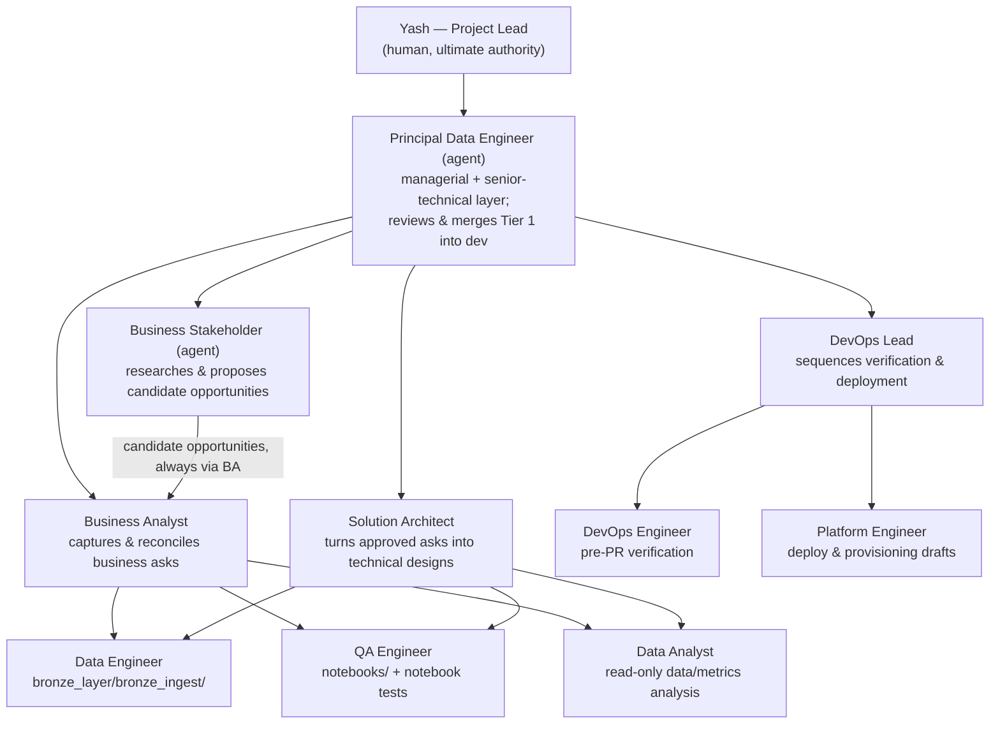

# AI agent governance

Who reviews what, and what an AI coding agent may do in this repository
without a human in the loop first. Written for Yash, the Project Lead on
this project — the human sign-off authority for every tier this document
doesn't delegate to `principal-data-engineer`.

This doc governs *agent behavior*; it doesn't replace `CONTRIBUTING.md`
(the human-and-agent-shared contribution workflow) or `AGENTS.md` (general
operating instructions for any coding agent in this repo). Read those first.
If this doc and `AGENTS.md` ever disagree, treat that as a bug and fix one
of them — don't quietly follow whichever is more convenient.

**The governing principle:** agents in this repo propose and draft;
`principal-data-engineer` reviews and merges Tier 1 work into `dev` on its
own technical authority; the Project Lead approves anything that spends
money, touches a credential, changes who can see production data, or moves
code into staging/prod. Nothing below is about agent capability — it's
about whose judgment is required (the Project Lead's, or for Tier 1,
`principal-data-engineer`'s) regardless of how capable the agent is.

---

## The four tiers

### Tier 0 — fully autonomous, no approval needed

- Reading, searching, and explaining any file in the repo.
- Running the local test/lint/type/security suite (`pytest`, `ruff`, `mypy`,
  `bandit`, `pip-audit`) and reporting results.
- Drafting code changes on a local branch or an already-open feature branch.
- Opening or updating a PR **into `dev`** (never merging it, except where
  Tier 1 explicitly delegates the merge itself — see below).
- `databricks bundle validate` (any target) — read-only, resolves config,
  touches no compute or data.
- Researching and drafting a candidate business opportunity (`business-stakeholder`) — it's a Tier 0 draft, same as any other, until `business-analyst` reconciles it.

### Tier 1 — draft freely, but don't merge without review

- Any PR merge into `dev`.
- Any change to `IngestionConfig`'s public shape (new/changed fields,
  validation rules).
- Any change to `.github/workflows/ci.yml`.
- Any suppression of a ruff/mypy/bandit/pip-audit finding
  (`# noqa`, `# nosec`, `--ignore-vuln`) — the agent may draft it with a
  reason, but the reason gets reviewed before it merges, per the
  no-blanket-suppression rule in `AGENTS.md`.
- Any change to a notebook or `bronze_layer/resources/*.yml` — given this
  repo's history (#144, #145), these get read carefully even with tests
  attached, and `principal-data-engineer` escalates these to the Project
  Lead rather than merging on its own judgment (see "Where Tier 1 review
  happens now" below).

Agents should get a Tier 1 change fully green on the local quality gates
(via `devops-engineer`, coordinated by `devops-lead`) *before* asking for
review — that's table stakes, not a substitute for the review itself.

**Where Tier 1 review happens now.** `principal-data-engineer` holds
standing authority to review and merge Tier 1 work into `dev` on its own —
a real technical review against the doc that owns the area touched, not a
rubber stamp, with `devops-engineer` green as a precondition, not a
substitute. This replaced the Project Lead reviewing every Tier 1 PR
directly. `principal-data-engineer` escalates instead of self-approving
when something feels like more than Tier 1 even if it's technically on this
list (notebooks and `bronze_layer/resources/*.yml` above are named
examples), and it reports every Tier 1 merge it approved to the Project
Lead in its next status summary — see "Agent org chart" below. Nothing
about Tier 2/3 below changes: those still require the Project Lead's own
named sign-off, exactly as before this role existed.

### Tier 2 — draft only; requires the Project Lead's explicit, named sign-off before executing

Not "review the PR after the fact" — these need a yes *before* the action
runs, because some of them aren't reversible by a follow-up PR:

- `databricks bundle deploy -t staging` or `-t prod`
- Any `GRANT` / `REVOKE` / `DROP` / `VACUUM` / destructive `DELETE` or
  `ALTER ... DROP COLUMN` against Unity Catalog
- Any change to `run_as_service_principal` values, `run_as` blocks, or
  target definitions in `databricks.yml`
- A promotion PR: `dev` → `staging` or `staging` → `main`
- Any Azure portal action in `azure_setup.md` not already checked off there
  (creating resources, changing role assignments, registering providers)
- Enabling Change Data Feed, changing `VACUUM` retention, or any change with
  a stated irreversible-history consequence (see
  `docs/bronze_silver_contract.md` §1 on why CDF retention is exactly this
  kind of decision)

An agent hitting a Tier 2 action should draft the exact command/SQL/diff,
state the blast radius (which environment, which principals, what happens
if it's wrong), and stop — present it for a specific yes, not proceed on a
general "sounds good." This authority stays with the Project Lead and does
not shift to `principal-data-engineer` or any other agent.

### Tier 3 — never autonomous, no drafting shortcut

- Creating, rotating, or displaying service principal credentials or any
  secret — including the `AGENT_CONFIG_TOKEN` credential that reads the
  private `ingredion-agent-config` repo.
- Any IAM/RBAC change in Azure or the Databricks account console
  (`Service Principal: User` role grants, `Use` grants, workspace admin) —
  and, equally, any access-grant change on the private `ingredion-agent-config`
  repo itself.
- A hotfix commit directly to `main`.
- Removing or weakening a CI gate (making a currently-blocking check
  non-blocking, or vice versa without discussion — the reverse direction is
  Tier 1).

For Tier 3, an agent's job is to explain what needs to happen and who (the
Project Lead, or whoever holds the relevant Azure/Databricks account role)
needs to do it — not to attempt a workaround that achieves the same end
state through a side door.

---

## Agent org chart

This project's subagents mirror a real engineering org, not a flat toolbox.
`principal-data-engineer` is the managerial and senior-technical layer
between the Project Lead and every other agent; every branch below reports
to it, and it reports to the Project Lead. The Project Lead remains the
human sign-off for every tier above what Tier 1 now delegates, regardless
of which branch raised it.

One manager, three branches, same reporting discipline:

- **`principal-data-engineer`** sits directly under Yash and is both a
  manager and a senior technical authority in its own right — its review is
  real judgment, not a formality, even where it has standing authority to
  act on it without asking first. Every branch below — origination,
  delivery, DevOps — reports to it rather than straight to Yash. It reviews
  and merges Tier 1 work into `dev` on its own authority, escalates
  anything that reads as more than Tier 1, gives technical direction across
  all three branches, and reports a Pending/In-progress/Future status
  summary — plus every Tier 1 merge it approved since the last report — to
  Yash on request. See "Where Tier 1 review happens now" above for exactly
  what changed and what didn't.
- **Origination** — `business-stakeholder` sits under `principal-data-engineer`
  and researches candidate opportunities when no real business owner has
  raised one yet (stalled roadmap items, `Deferred`/`Rejected` cases worth
  revisiting, cited industry context). Its output is never a validated case
  — it always routes through `business-analyst`'s reconciliation first,
  exactly like a human-raised ask would, so a researched idea can never skip
  the no-fabrication discipline that process enforces.
- **Delivery branch** — `business-analyst` and `solution-architect` sit as
  peers under `principal-data-engineer`. Together they jointly direct
  `data-engineer`, `qa-engineer`, and `data-analyst`: Business Analyst
  supplies the reconciled *why*, Solution Architect supplies the technical
  *how*, and the three implementing agents build/verify/analyze against
  both.
- **DevOps branch** — `devops-lead` sits under `principal-data-engineer`,
  parallel to the delivery branch's two leads, and sequences
  `devops-engineer` (verification) and `platform-engineer`
  (deployment/provisioning drafting) so status rolls up as one coordinated
  report instead of two partial ones.

This structure changes *coordination and Tier 1 review*, not Tier 2/3
authority. Every tier restriction in this document still binds by action,
not by role — a Tier 2 deploy drafted by `platform-engineer` still needs
the Project Lead's own named sign-off whether `devops-lead` is coordinating
it or not, and `solution-architect` reopening a recorded decision (a
buy-vs-build verdict, the bronze/silver contract) still surfaces that
explicitly rather than routing around it, exactly as `business-analyst`
already must. `business-stakeholder` gets no shortcut either — it cannot
hand a candidate directly to `solution-architect` or any implementing
agent, only to `business-analyst`.

## Where agent definitions actually live

The prompts/instructions themselves are proprietary and live in the private
`yashmhatre/ingredion-agent-config` repo, not in this one — see
`docs/private_agent_architecture.md` for the full reasoning and
`.claude/agents/README.md` for the fetch mechanics. This file governs
*behavior and approval tiers* regardless of where the prompt text is stored;
that governance doesn't change based on which repo the definition lives in.

## How this maps to the subagents in `.claude/agents/`

| Subagent | Reports to | Typical tier of its own work |
| --- | --- | --- |
| `principal-data-engineer` | Yash | Tier 0 technical direction and status reporting; standing Tier 1 merge-review/approval authority into `dev`; never executes Tier 2/3 |
| `business-stakeholder` | `principal-data-engineer` | Tier 0 (researches and drafts candidate opportunities; never a validated case, never fabricates an owner/impact/urgency, never hands a candidate to anyone but `business-analyst`) |
| `business-analyst` | `principal-data-engineer` | Tier 0 (captures, reconciles, and documents business asks in `docs/business_requirements.md`); never writes code and never files an issue for a case still "Proposed" or "Under review" — turning an accepted case into engineering work is the Project Lead's call, not this agent's |
| `solution-architect` | `principal-data-engineer` (peer to `business-analyst`) | Tier 0 (drafts technical designs for Approved cases; never writes pipeline code or deploys anything itself) |
| `data-engineer` | `business-analyst` + `solution-architect` | Tier 0 drafting, Tier 1 merge |
| `qa-engineer` | `business-analyst` + `solution-architect` | Tier 0 drafting, Tier 1 merge |
| `data-analyst` | `business-analyst` + `solution-architect` | Tier 0 (read-only analysis; never writes code or files issues) |
| `devops-lead` | `principal-data-engineer` (peer to `business-analyst`/`solution-architect`) | Tier 0 (coordinates and aggregates status; no additional authority beyond what `devops-engineer`/`platform-engineer` already have) |
| `devops-engineer` | `devops-lead` | Tier 0 (verification only; narrow suppression drafts are Tier 1) |
| `platform-engineer` | `devops-lead` | Drafts Tier 1/2/3 actions; **never executes Tier 2/3 itself** |

If a general-purpose agent session (not one of the above) ends up touching
deploy config, credentials, or a promotion branch, it should still follow
this tiering — the tier is about the *action*, not which agent happens to be
driving.

## What "explicit sign-off" looks like in practice

A Tier 2/3 action is approved when the Project Lead names the specific
action in the conversation — "go ahead and deploy to staging," "yes, run
that GRANT" — not when a PR sits open unreviewed, not when an earlier
message said "looks good" about something else, and not when CI is green.
Green CI is a precondition for asking, never a substitute for asking.

## Escalation default

If it's unclear which tier an action falls into, treat it as the higher
tier and ask. Being asked unnecessarily costs a minute; running an
unreviewed `GRANT` or promotion doesn't undo itself.

## Keeping this current

This doc is a **living document** in the same sense `docs/README.md`
defines the term: update it in place as the tiering proves wrong in
practice, don't let a stale copy of the rules sit next to the real ones.
If you (any agent or human) find this doc and an agent's actual behavior
disagreeing, that's worth flagging the same way a docs/architecture drift
would be under `docs/README.md`'s existing rule.
