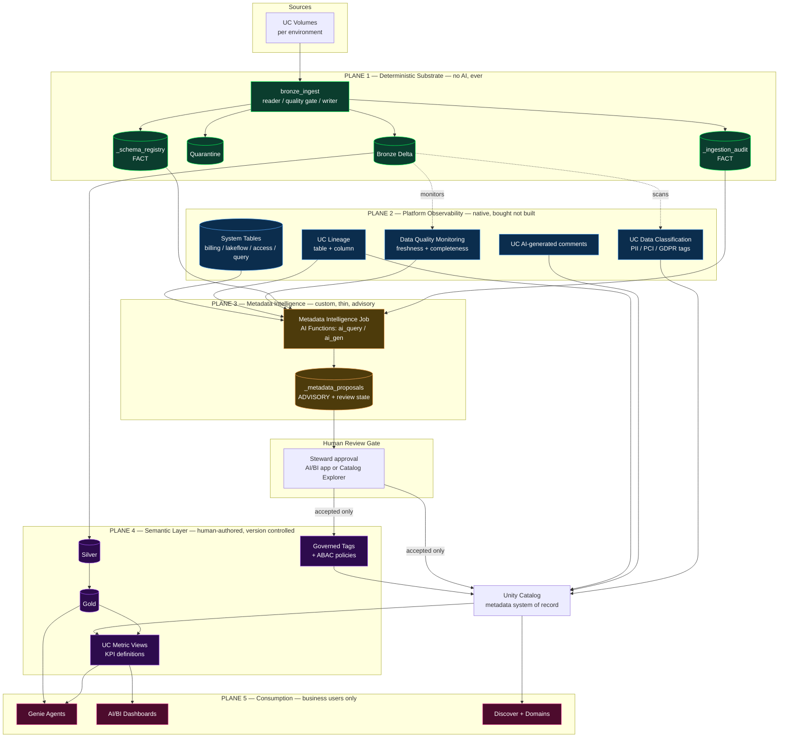
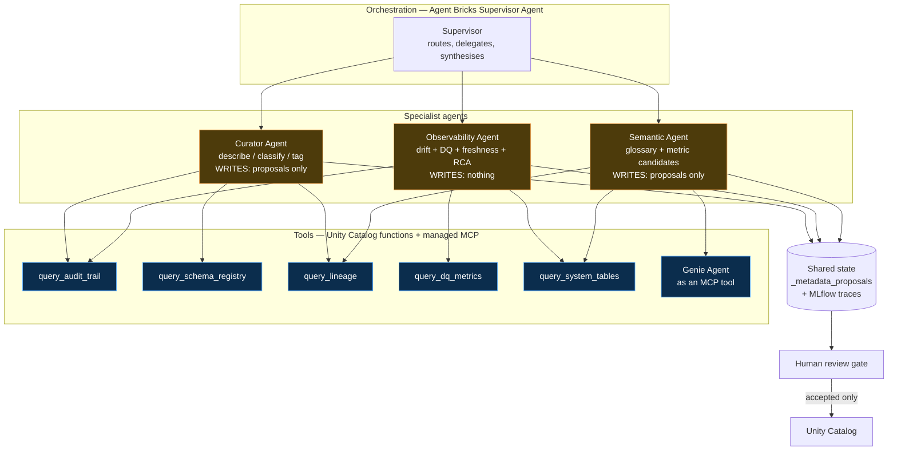
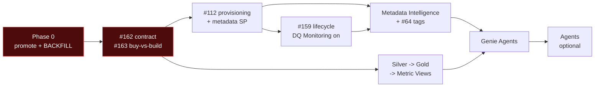

# Architecture Review & Design Proposal — Metadata Intelligence on Databricks Native AI

**Branch reviewed:** `claude/bronze-architecture-databricks-ai-r4csve` @ `3433cdd`
**Date:** 2026-08-07
**Scope:** the AI/metadata half of the target architecture — `bronze_layer/docs/architecture.md`
§ "Asynchronous AI-assisted metadata layer", the `_ai_metadata` three-table model, and the
proposed business-facing semantic layer. Read against the whole repository: 13 package
modules, `audit.py` / `schema_registry.py` / `catalog_metadata.py` in full, the bundle,
the job definition, and all 18 documents.

**Method:** code read, not doc read. Platform capability claims were verified against
Databricks documentation in August 2026 and are cited inline; anything I could not verify
is marked **[verify]** rather than asserted.

> This document is an assessment and a proposal. **No package code was changed, and no
> living document was rewritten.** Per `docs/README.md`, `bronze_layer/docs/architecture.md`
> owns design rationale; § 11 below lists exactly what would change there *if* this
> proposal is accepted. Until then, that document still stands.

---

## 1. Verdict

**The proposed AI layer is well-reasoned and mostly obsolete.** Not because the reasoning
was wrong — it was right when written — but because between then and now Databricks shipped
GA versions of three of the four things it proposed to build. The correct move is not to
port the design onto Databricks AI. It is to **delete most of its scope** and keep the
one part the platform does not cover.

**And the premise of the question needs correcting before anything is designed on it.**

The request asks whether to "redesign around Databricks Genie rather than external LLM
APIs." Those are not alternatives. They sit on different planes:

| | External LLM API | Genie |
|---|---|---|
| **What it is** | An inference endpoint you call | A conversational analytics interface over curated data |
| **Who invokes it** | A batch job, per table | A business user, per question |
| **What it produces** | Text you store | An answer, and the SQL behind it |
| **Direction** | *Writes* metadata | *Reads* metadata |

Genie cannot generate your column descriptions. It is a **consumer** of good metadata,
not a producer of it — its answer quality is a direct function of the curation it points
at. Substituting it for an LLM API is a category error, and an architecture built on that
substitution would fail in a specific and expensive way: badly, late, and in front of
business users.

The real substitutions are three, and they are better than the one that was asked about:

| Proposed custom component | Native replacement | Status |
|---|---|---|
| PII detection via LLM prompt | **UC Data Classification** — agentic, incremental, tags for PII/PCI/GDPR/HIPAA | **GA. Delete the custom scope.** |
| Freshness / volume anomaly intelligence (#61, #62) | **Data Quality Monitoring anomaly detection** — per-table commit-time model, freshness + completeness | **GA. Delete most of #61.** |
| Draft column/table descriptions | **UC AI-generated comments** | **GA. Use as the baseline.** |
| Schema drift *explanation* | Nothing native | **Keep. This is the residual.** |
| The LLM API itself | **AI Functions** — `ai_query`, `ai_gen`, `ai_classify` on Foundation Model APIs | Governed, in-boundary, SQL-native |

And Genie belongs where it was never placed: at the **top** of the stack, over a semantic
layer that does not exist yet.

**The single most decision-relevant finding in this review:** Genie is four hard gates deep
from where this repository stands today. It cannot be phase one, and any plan that puts it
there will produce a demo that cannot be promoted. § 12 sets out the chain.

---

## 2. Current Architecture Review

### 2.1 What is actually built

Verified by reading the code, not the README — the two disagree, and the code wins.

| Component | Doc claim | Code reality |
|---|---|---|
| Bronze ingestion, quality gate, quarantine, replay | Implemented | ✅ Implemented |
| Run-level audit trail | Implemented | ✅ `audit.py`, 19-column `AUDIT_SCHEMA`, `audited_run()` |
| Schema registry | **README: "planned"** | ✅ **Implemented** — `schema_registry.py`, upsert-on-change, fingerprinted |
| Catalog metadata | Partial | ✅ COMMENTs only; **tags deliberately not shipped** (#64) |
| Directory ingestion | Implemented | ✅ With per-file isolation, archival, retry-limit |
| Unity Catalog integration | Implemented | ✅ One catalog, three schemas, per-env service principals |
| Multi-agent architecture | **Listed as a current capability** | ❌ **Zero references anywhere in the repository** |
| Silver layer | Planned | ❌ A README and an archived `flattener.py` |
| Gold layer | Planned | ❌ Does not exist |
| Business semantic layer | Listed as a current capability | ❌ Does not exist |
| AI metadata layer | Designed | ❌ Designed only — no `_ai_metadata`, no job, no module |

Three of the capabilities in the brief's "current capabilities" list — multi-agent
architecture, the semantic layer, and Silver/Gold — do not exist in any form. This is
worth stating plainly because the roadmap below depends on it: **this is a
one-layer platform with an excellent bronze layer**, not a platform with a missing AI tier.

### 2.2 What the existing design got right

These should survive the redesign unchanged, and the redesign should be judged partly on
whether it preserves them.

1. **The two-lane split.** Deterministic ingestion and advisory intelligence in separate
   execution lanes, with no shared transaction and no blocking call. This is the correct
   top-level decomposition and it does not change.
2. **"Nothing in the write path ever reads `_ai_metadata`."** An invariant enforced by
   construction rather than by convention. Keep the invariant; § 4 changes only where the
   output lands.
3. **Fact / interpretation separation.** `_ingestion_audit` and `_schema_registry` record
   what the pipeline *knows*; the AI table records *opinion*. This distinction is the
   backbone of everything in § 3 and § 5.
4. **Rejecting the in-job background thread.** The reasoning — a warm cluster making LLM
   calls is the exact pattern the 96%-compute finding condemns — is correct and gets
   *stronger* under the native design, because AI Functions bill per token under
   `MODEL_SERVING` / `BATCH_INFERENCE` rather than per second of held compute.
5. **`record_schema()` returning `(fingerprint, changed)`.** Drift detection already exists,
   is deterministic, costs one small read on the unchanged path, and is already wired into
   the audit row. The Metadata Intelligence Layer inherits a working drift detector and
   never needs to build one.
6. **`catalog_metadata.py`'s diff-and-apply.** Driven by a measured observation — comment
   DDL creates a new Delta version even when the comment is unchanged. **This module is the
   correct write mechanism for AI-generated descriptions and needs no redesign**, only a
   second caller.

That last point matters more than it looks. The hardest part of writing AI-generated
documentation into a catalog safely — not thrashing table history — is already solved here,
correctly, for a reason that was measured rather than assumed.

---

## 3. Problems Found

Ordered by consequence.

### P0 — Genie pointed at Bronze produces confident wrong answers

Not a hypothetical. Bronze, by this repository's own design, contains:

- `_corrupt_record` — malformed source rows retained under `PERMISSIVE` mode
- nested structs and arrays preserved verbatim (`flatten_mode` was deliberately removed)
- `_batch_id`, `_source_file`, `_ingested_at` — operational columns with no business meaning
- a sibling `<table>_quarantine` holding rows that **failed the quality gate**
- rows that a replay may later promote, so the same business fact can exist in both tables

A business user asking Genie "how many orders last month?" against this gets a number that
is wrong in at least three independent ways — corrupt rows counted, quarantined rows either
missing or double-counted after replay, and no deduplication semantics. Genie will phrase
that number fluently and cite the SQL it ran, which is worse than an error: it is a
plausible answer with a provenance trail.

**Genie's accuracy is a function of what it points at.** The mitigation is not prompt
engineering or space instructions. It is not pointing Genie at Bronze. Which means the
prerequisite for any Genie work is Silver, Gold, and Metric Views — none of which exist.

### P1 — `_ai_metadata` as designed is a shadow catalog

The three-table model gets the *separation* right and the *destination* wrong.

AI output written to a private Delta table that nothing reads is metadata that does not
govern anything. Unity Catalog is already the metadata system of record — it carries
comments, governed tags, lineage, classification, ownership and permissions, and it is what
Catalog Explorer, Discover, AI/BI and Genie all read. A parallel `_ai_metadata` table
creates a second place where the truth about a column lives, with no reconciliation
between them.

**The output surface must be Unity Catalog.** `_ai_metadata` survives, demoted: it becomes
the **staging and review queue** — proposals awaiting human ratification, plus the audit
trail of what was accepted, by whom, and when. Nothing more. The invariant from § 2.2
holds unchanged; only the terminus moves.

### P1 — the AI layer has a hard, unstated dependency on an unfinished migration

`CHANGELOG.md` 0.5.0 documents that `_ingestion_audit.table` was renamed to `table_name`,
that the audit writer appends with `mergeSchema: true`, and that consequently **the table
ends up with two columns meaning the same thing, each half-populated** — with a backfill
that must be run manually, per environment, after the first post-upgrade run.

A metadata intelligence layer reads `_ingestion_audit` as its primary input. If it reads it
before that backfill, every query returns a plausible, complete-looking answer covering only
half the runs — and the layer's entire output is derived from a silently truncated input.
This is the same failure shape as #146, one abstraction level up.

**The backfill is a hard gate on the intelligence layer, and it is currently tracked
nowhere as such.**

Compounding it: `docs/roadmap.md` Phase 0 records that `dev` was 38 commits ahead of
`main`, meaning production ran pre-0.5.0 code. The intelligence layer's input schema
depends on which side of that promotion each environment is on.

### P1 — #159 changes severity under this design

`_ingestion_audit` writes one row as its own Delta commit — measured at ~18,000 tiny
files/year for a daily 50-unit batch, ~1M/year for a 30-second stream. Today that is a
compounding cost nobody reads. Under this design **it becomes the hot read path of a job
that runs daily forever**, and its scan cost grows linearly and permanently.

#159 moves from "costs compound silently" to a prerequisite.

### P2 — an AI job writing to Unity Catalog needs an identity nobody has designed

`catalog_metadata.py` currently runs inside the ingestion job, as the ingestion service
principal, applying comments the config author wrote. A metadata intelligence layer
applying *generated* comments and *governed tags* across the catalog is a different
security proposition:

- it needs `MODIFY` on objects the ingestion SP has no reason to touch
- governed tags drive **ABAC row filters and column masks** — so a tag write is an access
  control write
- running it as the ingestion SP hands catalog-wide governance authority to the identity
  that ingests files

It needs its own service principal, narrowly granted, and every applied comment or tag
needs to be attributable and revertible. `system.access.audit` gives attribution for free
once the identity is separate — and gives nothing useful if it is not.

### P2 — "Business KPI generation" is the one item on the brief's list that must be refused

An LLM inventing the definition of *revenue*, *active customer* or *on-time delivery* is
not a productivity feature. A KPI definition is a **contract** between the data platform
and the business, and the entire value of a semantic layer is that the definition is
stable, reviewed, and version-controlled.

AI may draft *candidate* definitions from query history and may *explain* an existing
metric in business language. The definition itself is human-authored in a Unity Catalog
Metric View, reviewed, and deployed through the bundle. § 5 treats this as a hard line.

### P2 — ten agents for a one-layer platform

The brief proposes ten agents for a platform that today runs one job, over one layer,
processing ~50 files per run. Each agent is a deployable unit with its own failure mode,
identity, cost line and upgrade path. Ten of them is more operational surface than the
ingestion framework they would describe.

The number that matches the problem is **three**, and phase one needs **zero** — see § 6.
A scheduled SQL statement calling `ai_query` is not an agent and does not benefit from
being made into one.

### P3 — documentation will be internally inconsistent the moment this lands

`README.md` lists the schema registry as planned; it is implemented. `README.md` and
`bronze_layer/docs/architecture.md` both describe the generic-LLM design. `docs/README.md`
is explicit that living documents must not drift. Any acceptance of this proposal carries a
documentation change set — enumerated in § 11 rather than performed here.

---

## 4. Recommended Enterprise Architecture

### 4.1 The organising principle

Five planes. A component belongs to exactly one, and the rule for which one is a single
question: **what happens if it is wrong?**

```
Plane 5  CONSUMPTION      Genie Agents, AI/BI dashboards, Discover
                          Wrong -> a business user gets a bad answer     -> curate the input

Plane 4  SEMANTIC         UC Metric Views, governed tags, glossary
                          Wrong -> every downstream number is wrong      -> human-authored only

Plane 3  INTELLIGENCE     Narration, drafts, explanations, proposals
                          Wrong -> a human rejects a proposal            -> AI allowed, review gated

Plane 2  PLATFORM         Data Classification, DQ Monitoring, lineage,
         OBSERVABILITY    system tables, AI comments
                          Wrong -> Databricks' problem                   -> buy, do not build

Plane 1  DETERMINISTIC    Ingestion, quality gate, quarantine, audit,
         SUBSTRATE        schema registry, replay
                          Wrong -> silent data corruption                -> never AI
```

Everything below follows from this. The four rules it produces:

> **Detect deterministically. Describe with AI. Decide with humans. Enforce with policy.**

### 4.2 Target architecture



**Read the arrows into Unity Catalog.** Every path from Plane 3 to Unity Catalog passes
through the review gate. There is no arrow from Plane 3 to Plane 1 at all — the § 2.2
invariant, now structural rather than conventional.

### 4.3 What each plane costs you to get wrong

| Plane | Failure blast radius | Reversibility |
|---|---|---|
| 1 Deterministic | Silent data corruption, undetectable | Very low — needs replay or reload |
| 2 Platform | Missed anomaly, missed classification | High — rescan |
| 3 Intelligence | A bad proposal in a queue | Total — reject it |
| 4 Semantic | Every report wrong, trust destroyed | Low — numbers were already published |
| 5 Consumption | One user, one bad answer | High — if the layer below is right |

Planes 1 and 4 are the two where a mistake is expensive and hard to reverse. **Those are
exactly the two planes with no AI in them.** That is not a coincidence; it is the design.

---

## 5. Metadata Intelligence Layer

Not "an AI metadata job." A layer with three distinct tiers, and the discipline is in
keeping them apart.

```mermaid
graph LR
    subgraph T1["Tier 1 — FACTS — deterministic, always"]
        F1["Schema + fingerprint<br/>schema_registry.py"]
        F2["Run outcomes, row counts<br/>_ingestion_audit"]
        F3["Freshness + completeness<br/>DQ Monitoring"]
        F4["Lineage graph<br/>system.access.table_lineage"]
        F5["Classification tags<br/>UC Data Classification"]
        F6["Usage + cost<br/>system.query / system.billing"]
    end

    subgraph T2["Tier 2 — NARRATION — AI over facts, never over raw data"]
        N1["Drift explanation"]
        N2["Table + column descriptions"]
        N3["DQ narrative"]
        N4["Lineage summary"]
        N5["Impact analysis"]
    end

    subgraph T3["Tier 3 — PROPOSALS — AI suggests, human ratifies"]
        P1["Glossary terms"]
        P2["Semantic tags"]
        P3["Candidate metric definitions"]
        P4["Classification overrides"]
    end

    T1 --> T2 --> T3
    T3 --> HUMAN["Steward review"]
    HUMAN --> UC["Unity Catalog"]
    T2 -.low risk - auto-publish.-> UC
```



**Tier 2 reads Tier 1's output, never the data itself.** A description is generated from
schema, statistics, lineage and audit history — not from sampled rows. This is deliberate
and it is a governance property, not a cost optimisation: it means the intelligence layer
never has, and never needs, `SELECT` on customer data. Its grants stay metadata-only,
which is what makes it safe to run broadly.

### 5.1 The classification the brief asked for

| Capability | Deterministic | AI | Where it runs | Verdict |
|---|---|---|---|---|
| **Metadata enrichment** | Facts | Prose | Split | Hybrid — never blur the two |
| **Business glossary generation** | — | Draft only | Tier 3 | AI drafts, steward ratifies, lands as governed tags. Never auto-applied |
| **Column descriptions** | — | ✅ | Native first | **UC AI-generated comments** as baseline; custom only for domain context UC cannot see |
| **Table summaries** | Inputs | Output | Tier 2 | AI over schema + audit + lineage |
| **Data quality insights** | ✅ Computation | Narration | Plane 2 + Tier 2 | DQ Monitoring computes; AI explains |
| **Freshness insights** | ✅ **Entirely** | Narration only | Plane 2 | **Never AI-computed.** DQ Monitoring builds a per-table commit-time model. An LLM guessing at freshness is indefensible |
| **Schema drift explanation** | ✅ Detection | Explanation | Plane 1 + Tier 2 | Detection already exists and is exact. AI explains what a change *means* |
| **Business KPI generation** | ✅ **Definition** | Draft + explain | Plane 4 | **Hard line.** See § 3 P2. Human-authored Metric Views only |
| **Semantic tagging** | Application | Suggestion | Tier 3 | AI suggests; governed tag application is a governed write |
| **Classification** | Enforcement | Detection | Plane 2 | **UC Data Classification.** Delete the custom scope entirely |
| **PII detection** | Enforcement | Detection | Plane 2 + 4 | Detect natively; **enforce with ABAC column masks keyed on the governed tag** |
| **Lineage summarization** | ✅ Graph | Summary | Plane 2 + Tier 2 | Lineage is a system table. AI only compresses it into prose |
| **Documentation generation** | — | ✅ | Tier 2 | The clearest AI win in the whole list |

### 5.2 What must never touch AI

Non-negotiable. Every item is something where a wrong answer is either silent or
irreversible:

1. **The write path** — reader dispatch, quality gate, quarantine routing, merge keys,
   dedupe, idempotency, `txnAppId`/`txnVersion`
2. **Any number in an audit row** — `row_count`, `rows_inserted`, `rows_updated`.
   #149 fought to make these mean one consistent thing; an estimate would undo it
3. **Schema drift *detection*** — a fingerprint comparison is exact and free
4. **Access decisions** — grants, row filters, column mask *enforcement*
5. **KPI definitions**
6. **Retry, archival and quarantine policy** — #183 just unified this into one policy;
   it stays deterministic
7. **Anything feeding a regulatory or financial report without human sign-off**

The test: *if this is wrong, does anyone find out?* If the answer is no, it does not get AI.

---

## 6. Multi-Agent Architecture

### 6.1 Start by not building agents

The brief lists ten. The honest engineering answer is that **phase one needs zero**, and
saying so is more useful than designing ten.

An agent earns its existence when a task requires **planning under uncertainty** — deciding
which tools to call, in what order, based on intermediate results. Most of the metadata
work here is not that. "For every table whose fingerprint changed since the last watermark,
generate a description" is a `MERGE` with an `ai_query` in the projection. It is a SQL
statement on a schedule. Wrapping it in an agent adds a planner, a tool registry, a trace
store, an eval harness and a serving endpoint to a workload that does not branch.

Build agents when the platform is agentic. The platform is not yet: it has one layer.

### 6.2 When agents do become correct — three, not ten

The three that survive are the three where the task genuinely branches:



| Agent | Owns | Reads | Writes | Why it branches |
|---|---|---|---|---|
| **Curator** | Descriptions, semantic tags, classification review | Registry, audit, lineage, UC | `_metadata_proposals` | Description quality depends on lineage depth and sibling tables — it must decide how far to look |
| **Observability** | Drift explanation, DQ narrative, root cause | DQ metrics, audit, system tables, lineage | Nothing. Reports only | Root cause is inherently a search: symptom → correlate → hypothesise → check upstream |
| **Semantic** | Glossary drafts, metric candidates, Genie curation feedback | Query history, lineage, Genie logs | `_metadata_proposals` | Must reconcile how a term is used across teams against how it is defined |

**Merged deliberately, and why:**

- Documentation, Metadata and Governance agents → **Curator**. Same inputs, same output
  table, same review gate. Three agents that always run together are one agent.
- Freshness, Schema Drift, Data Quality → **Observability**. All three answer *"is this
  table healthy and why not"*. Splitting them guarantees three partial answers to one
  question, and the root-cause case needs all three inputs simultaneously.
- KPI and Business Glossary → **Semantic**. Both are "what does the business mean by this."
- Lineage Agent → **deleted**. Lineage is a system table. Querying it is a *tool*, not an
  agent. This is the clearest case of an agent proposed for a task that is a `SELECT`.

### 6.3 Communication, ownership, memory

**Communication.** Not agent-to-agent. Agents talk to the **Supervisor**, and share state
through `_metadata_proposals`. Direct agent-to-agent messaging in a three-agent system
creates a distributed system with no transaction boundary for no benefit — Databricks'
Supervisor Agent coordinates Genie Agents, UC functions, MCP servers and custom agents
under one orchestrator, which is the pattern to use rather than to reinvent.

**Ownership.** Each agent is a separate service principal with distinct grants:

| Agent | Grants | Explicitly denied |
|---|---|---|
| Curator | `USE` + `SELECT` on **metadata objects only**; `MODIFY` on the proposals table | `SELECT` on any bronze/silver data table |
| Observability | `SELECT` on system tables + DQ metric tables | Any write, anywhere |
| Semantic | `SELECT` on `system.query.history`, lineage, Metric Views | Any write outside proposals |
| **Review gate** | The **only** principal with `MODIFY` on UC comments and governed tags | — |

That last row is the load-bearing one. **No agent holds catalog write authority.** The
review gate does, and the gate is a human decision recorded in `system.access.audit`.

**Shared memory.** Three stores, deliberately separate:

| Store | Contains | Lifetime |
|---|---|---|
| `_metadata_proposals` (Delta) | Proposals, state, reviewer, decision, applied version | Permanent — the governance record |
| MLflow traces | Prompts, tool calls, tokens, latency | 90 days — debugging and eval |
| Supervisor conversation state | Within-task context | Task lifetime |

**Do not build a vector store for this.** The corpus is a few hundred tables' metadata,
fully queryable in SQL, and it changes on a fingerprint. Retrieval here is a `WHERE`
clause. Add vector search when the corpus is unstructured documents, which is a different
project.

---

## 7. Event Flow

### 7.1 Recommended: watermarked scheduled batch, with two exceptions

The existing design's reasoning — non-urgent workload, event triggers are meaningfully more
infrastructure, nobody needs a PII flag within seconds — was right and is now **more** right,
because UC Data Classification and DQ anomaly detection already do their own incremental
scanning. Building a trigger for work the platform already schedules is pure cost.

| Trigger model | Verdict | Reasoning |
|---|---|---|
| **After every ingestion** | ❌ | Couples lanes; makes ingestion latency depend on LLM latency; N× the cost for the same daily outcome; violates the § 2.2 invariant in spirit |
| **Scheduled + change watermark** | ✅ **Primary** | Amortises startup across tables; skips unchanged tables via fingerprint; frequency is an independent cost lever |
| **Event-driven** | ⚠️ Narrow | Only for drift on a **certified** table — that is the one case with an SLA |
| **CDC driven** | ❌ | CDF tracks row changes. Metadata intelligence cares about *schema and behaviour*, not rows. Wrong signal, and #58's CDF decision is gated on Silver anyway |
| **UC event driven** | 🔍 **[verify]** | Verify current UC event/trigger support in your workspace before designing on it |
| **Workflow based** | ✅ **Mechanism** | Not an alternative — this is *how* the schedule runs. A multi-task Lakeflow job with proper dependencies |

**The watermark is the whole design.** The steady-state cost of this layer is
`O(tables that changed)`, not `O(tables)`. `_schema_registry.schema_fingerprint` and
`_ingestion_audit.finished_at` already provide it. That property is what keeps this
affordable at 500 tables, and it is inherited free from work already shipped.

### 7.2 Event flow

```mermaid
sequenceDiagram
    participant JOB as Ingestion Job
    participant BR as Bronze Delta
    participant AUD as _ingestion_audit
    participant REG as _schema_registry
    participant DQ as DQ Monitoring
    participant DC as Data Classification
    participant MI as Metadata Intelligence
    participant PROP as _metadata_proposals
    participant H as Steward
    participant UC as Unity Catalog
    participant G as Genie Agent

    rect rgb(11,61,46)
    Note over JOB,REG: LANE 1 — synchronous, deterministic, no AI
    JOB->>BR: write
    JOB->>REG: record_schema -> fingerprint, changed
    JOB->>AUD: audited_run -> one row
    end

    rect rgb(11,45,77)
    Note over DQ,DC: LANE 2 — platform-native, own cadence
    DQ->>BR: profile freshness + completeness
    DC->>BR: scan and classify -> PII tags
    DC->>UC: apply classification tags
    end

    rect rgb(77,59,11)
    Note over MI,PROP: LANE 3 — scheduled, watermarked, advisory
    MI->>REG: changed since watermark?
    MI->>AUD: run history for those tables
    MI->>DQ: quality + freshness metrics
    MI->>MI: ai_query -> descriptions, drift explanation
    MI->>PROP: write proposals, status = PENDING
    end

    rect rgb(45,11,77)
    Note over H,UC: GATE — human, audited
    H->>PROP: review
    H->>UC: apply accepted only, via catalog_metadata diff-and-apply
    H->>PROP: status = APPLIED, reviewer, timestamp
    end

    rect rgb(77,11,45)
    Note over G: CONSUMPTION — reads curated metadata only
    G->>UC: read comments, tags, Metric Views
    G-->>H: business answer, grounded
    end

    Note over JOB,G: No arrow from Lane 3 to Lane 1. Ever.
```



---

## 8. Component Responsibilities

| Component | Owns | Must not |
|---|---|---|
| `bronze_ingest` | Reading, quality gate, quarantine, writing, facts | Call any model. Read `_metadata_proposals`. Apply generated metadata |
| `schema_registry.py` | Current schema + fingerprint per table | Interpret a change |
| `audit.py` | One exact row per run | Estimate anything |
| `catalog_metadata.py` | Diff-and-apply COMMENT DDL | Decide *what* the comment says |
| **UC Data Classification** | PII/PCI/GDPR detection and tagging | — |
| **DQ Monitoring** | Freshness, completeness, drift metrics | — |
| **System tables** | Lineage, cost, access, run history | — |
| **Metadata Intelligence Job** | Narration and proposals from facts | Write to UC. Read data rows. Gate ingestion |
| **`_metadata_proposals`** | Proposals + review state + audit | Be read by the write path |
| **Review gate** | The only writer of AI-derived UC metadata | Auto-approve tags that drive ABAC |
| **Metric Views** | KPI definitions | Be generated |
| **Genie Agents** | Business Q&A over curated assets | Point at Bronze, quarantine, or audit tables |

---

## 9. Databricks Native Service Mapping

The direct answer to "which parts should be native." Verified August 2026.

| Need | Native service | Replaces | Confidence |
|---|---|---|---|
| PII / sensitive data detection | **UC Data Classification** — agentic, incremental, PII/PCI DSS/GDPR/HIPAA/GLBA tags | Custom LLM PII prompt | **GA — verified** |
| Enforce masking on classified data | **ABAC row filters + column masks on governed tags** | Nothing built | **GA — verified** |
| Freshness + completeness anomalies | **DQ Monitoring anomaly detection** — per-table commit-time model, metastore-wide dashboard | Most of #61, #62 | **GA — verified** |
| Baseline descriptions | **UC AI-generated comments** | Custom description prompt | **GA — verified** |
| LLM inference | **AI Functions** — `ai_query`, `ai_gen`, `ai_classify` on FM APIs | External OpenAI / Azure OpenAI | **GA — verified.** Needs DBR 18.2+, and **not available on Pro or Classic SQL warehouses** |
| A *specific* frontier model | **Databricks-hosted Claude** (Opus / Sonnet / Haiku families) via FM APIs, with prompt caching; Anthropic Messages API compatibility layer for SDK-native code | An Anthropic API key, or an individual's Claude subscription | **GA — verified** (Messages API Beta as of 2026-06). See § 10.6 |
| Business semantic layer | **UC Metric Views** — measures separated from dimensions, queryable from SQL, notebooks, dashboards, Genie | A hand-built gold semantic model | **GA + open sourced — verified** |
| Business Q&A | **Genie Agents** (formerly Genie Spaces), with trusted assets and instructions | Custom chat app | **GA — verified** |
| Programmatic Genie | **Genie Conversation API** + Management API for CI/CD | — | **GA — verified** |
| Multi-agent orchestration | **Agent Bricks Supervisor Agent** — coordinates Genie Agents, agent endpoints, UC functions, MCP servers, custom agents | Custom orchestrator | **GA/Beta — verified** |
| Agent tools | **UC functions + managed MCP servers**; MCP Catalog for discovery | Custom tool registry | Beta — **[verify] in your workspace** |
| Lineage | **`system.access.table_lineage` / `column_lineage`** | Custom lineage | GA |
| Cost attribution | **`system.billing.usage`** — AI Functions under `MODEL_SERVING`/`BATCH_INFERENCE`, anomaly detection under `DATA_QUALITY_MONITORING` | Custom cost tracking | GA |
| Run observability | **`system.lakeflow.*`** | Custom job monitoring | GA |
| Data product catalog | **Discover + Domains** — internal marketplace over tables, dashboards, notebooks, Metric Views, Genie Agents, apps | A custom catalog | **Public Preview — verified** |
| Deployment of all of it | **Declarative Automation Bundles** (formerly Asset Bundles) — supports jobs, dashboards, quality monitors, Metric Views, and **Genie Agents** | Manual clickops | GA; Genie Agents need CLI ≥ 1.3.0 and the **direct deployment engine** |

**Naming note.** Databricks renamed several of these in 2026, and the brief uses the older
names: *Genie Spaces → Genie Agents*, *Asset Bundles → Declarative Automation Bundles*,
*Lakehouse Monitoring → Data Quality Monitoring*, *Delta Live Tables → Lakeflow Declarative
Pipelines*. Worth adopting in docs now — the API paths keep the old nouns
(`/api/2.0/genie/spaces/{space_id}`), which is its own source of confusion.

### 9.1 What is left to build after this mapping

Almost nothing, and that is the point:

1. The **Metadata Intelligence job** — a watermarked read over facts, `ai_query` for
   narration, a write to the proposals table. Small.
2. The **proposals table and review workflow** — Delta table plus an AI/BI or Databricks
   App review surface.
3. **A second caller for `catalog_metadata.py`** — applying approved proposals through the
   existing diff-and-apply path.
4. **Silver, Gold, Metric Views** — the real work, and it is data modelling, not AI.

The original design's PII detection, drift intelligence and description generation are all
now platform features. **Roughly 70% of the proposed AI layer should be deleted rather
than ported.**

---

## 10. Cost Analysis

### 10.1 The finding that reframes this question

This repository already established that **96% of Databricks spend is compute time**, and
used it correctly to reject the in-job background thread.

Apply it here and the conclusion is uncomfortable for the way the question was asked.
Work the numbers for this estate — ~50 tables, daily, only changed tables processed:

| | Estimate |
|---|---|
| Tables changed per day, steady state | ~5–10 of 50 |
| Prompt size per table (schema + stats + audit + lineage — **not rows**) | ~1.5–2K input tokens |
| Output per table | ~200–400 tokens |
| **Daily token volume** | **~20K tokens** |

Twenty thousand tokens a day is a rounding error at any provider's list price. Even at
500 tables with everything changing daily it stays in the low hundreds of thousands.

**Token price is not a decision variable at this scale.** The costs that actually move are:

| Real cost driver | Magnitude |
|---|---|
| Compute the job holds while running | **Dominant** — the 96% finding |
| SQL warehouse serving Genie queries | **Dominant once business users arrive** — unbounded, user-driven |
| Engineering time maintaining a custom AI service | **Dominant over a 3-year horizon** |
| Token spend | Noise |

Any comparison decided on token price is optimising the smallest term. The right criterion
is **governance and maintenance**, and that changes the answer.

### 10.2 The comparison

| | External OpenAI | Azure OpenAI | **AI Functions** | Genie Agents | Local LLM / Ollama |
|---|---|---|---|---|---|
| **Role** | Generation | Generation | **Generation** | **Consumption** | Generation |
| **Operational cost** | Tokens + egress | Tokens + endpoint | Tokens, billed on the Databricks invoice | Warehouse compute per query | **GPU 24/7 for ~5 min/day of work** |
| **Utilisation** | On demand | On demand | On demand | On demand | **~0.3%** |
| **Maintenance** | SDK, retries, rate limits, secret rotation | Same + endpoint lifecycle | **None — a SQL function** | Space curation | **Model updates, quantisation, evals, CVE patching, capacity** |
| **Governance** | ❌ Data leaves the boundary | ⚠️ Better; still a separate control plane | ✅ **In-boundary, UC-governed, `system.billing` attributed** | ✅ In-boundary | ⚠️ In-boundary, unaudited |
| **Security** | Secret scope + egress from serverless | Private endpoint + managed identity | ✅ **No secret exists to leak** | ✅ | Own the whole stack |
| **Scalability** | Rate limits | Quota per deployment | ✅ Managed batch inference | Warehouse scaling | Your GPU count |
| **Enterprise readiness** | Weakest | Adequate | ✅ **Strongest** | ✅ Strongest | Weakest |
| **Verdict** | **Reject** | **Reject** | ✅ **Adopt** | ✅ **Adopt — different plane** | **Reject** |

### 10.3 Why external APIs lose on governance, not price

1. **Data leaves the governance boundary.** Even sending only schema and column names ships
   your data model to a third party. Column names *are* sensitive — `patient_mrn`,
   `acquisition_target_name`.
2. **A secret exists.** #115 has not shipped and is blocked on #112. An external API needs
   a key in a scope, rotated, and never logged — and `run_ingestion.py:67` already logs the
   full config today. AI Functions need no key at all: **the strongest security control is
   the credential that does not exist.**
3. **Serverless egress.** A network path out of serverless compute to a public endpoint is
   a new control to justify to security.
4. **Split cost attribution.** AI Functions land in `system.billing.usage` beside every
   other line. An external invoice does not, and nobody reconciles it.

### 10.4 Why local LLMs lose hardest

A GPU endpoint costs money continuously for a workload that needs a few minutes of
inference per day — **~0.3% utilisation**, against a repository whose central cost finding
is that idle compute is the enemy. Add owning model updates, evaluation and patching, and
it is the most expensive option on the table by a wide margin while being the least
governed. It contradicts this project's own established design constraint.

### 10.5 The cost risk nobody has budgeted

**Genie is a consumption cost with no natural ceiling.** Every business question is a
warehouse query. Fifty analysts exploring freely on an oversized serverless warehouse will
cost more than the entire ingestion platform.

Controls, before the first business user is onboarded: a right-sized dedicated warehouse
with aggressive auto-stop, per-space warehouse assignment, and a `system.billing.usage`
dashboard broken out by warehouse. This belongs in the phase plan, not in a post-mortem.

### 10.6 "Can we use an existing Claude or ChatGPT subscription instead of buying credits?"

A reasonable question, asked often enough to answer here rather than in a thread. The
answer is **no for the pipeline, and unnecessary — because the thing it is reaching for is
already available a better way.**

**Why a consumer subscription cannot back a production job.** A Claude Pro/Max subscription
covers claude.ai on web, desktop and mobile, plus Claude Code, against one shared usage
pool. Programmatic API access is a separate product billed via prepaid usage credits. There
is no key a subscription issues that a Databricks job could authenticate with.

**The terms question is the weaker objection. The architectural one is disqualifying on its
own:**

| | Consequence |
|---|---|
| The credential is a **person**, not a service principal | The platform stops when they leave, rotate a password, or exhaust their limit |
| Cannot be granted to the metadata service principal (§ 3, P2) | The identity model in § 6.3 becomes unimplementable |
| No `system.billing.usage` attribution | The cost is invisible to every FinOps control the platform has |
| No Unity Catalog audit of the call | A governance layer whose own actions are unauditable |
| Interactive rate limits, not batch limits | Designed for a human typing, not 50 tables on a schedule |

Every objection in § 10.3 applies, and the first row makes it worse than an external API
key rather than better: at least a key can be owned by a service.

**Separate development from runtime.** These sound alike and are not:

| | Subscription appropriate? |
|---|---|
| **Development** — designing this architecture, writing the pipeline, reviewing code | ✅ Yes. This is what Claude Code on a Pro/Max plan is for |
| **Runtime** — a scheduled job describing 50 tables every night | ❌ No. Use AI Functions |

**What the question is actually reaching for is available, and better.** The underlying want
— *use a frontier model without a second vendor account, a second key and a second invoice*
— is exactly what the native path already delivers. Databricks hosts Claude models
(Opus, Sonnet and Haiku families) directly in Foundation Model APIs, callable from
`ai_query` in SQL:

- No Anthropic account, no API key — **no secret exists to leak**, which was § 10.3's
  strongest argument, now strengthened rather than traded away
- Billed as Databricks DBUs on the existing invoice, attributed in `system.billing.usage`
  under `MODEL_SERVING` / `BATCH_INFERENCE`
- Prompt caching supported
- An Anthropic Messages API compatibility layer for SDK-native code, if `ai_query` is ever
  too coarse

So the choice is not *Claude or Databricks*. It is **Claude on Databricks**, which satisfies
the cost instinct behind the question and the governance requirement at the same time.

**Model selection for this workload.** Inputs are schema, statistics, audit history and
lineage — never data rows (§ 5). Output is a paragraph. Haiku is more than adequate for
descriptions and summaries; Sonnet is worth it for drift explanation and root-cause
narration, where the reasoning is the product. At ~20K tokens/day the difference between
them is noise against compute (§ 10.1), so **choose on output quality, not on price** —
and revisit only if the estate grows by an order of magnitude.

---

## 11. Migration Strategy

Nothing here is a rewrite. The existing design's principles survive; its *implementation
targets* change.

| # | Change | From | To | Effort |
|---|---|---|---|---|
| 1 | PII detection | Custom LLM prompt | UC Data Classification | **Delete scope** |
| 2 | Freshness/volume anomalies (#61, #62) | Custom baselines over audit | DQ Monitoring + built-in dashboard | **Delete most of #61** |
| 3 | Description baseline | Custom prompt | UC AI-generated comments | **Delete scope** |
| 4 | Inference | Generic LLM / OpenAI | `ai_query` / `ai_gen` | Swap |
| 5 | AI output destination | `_ai_metadata` terminal table | `_metadata_proposals` → review → UC | **Redesign** |
| 6 | Drift explanation | Planned | Keep — the residual custom capability | Build |
| 7 | Semantic layer | Undesigned | UC Metric Views, human-authored | Build (Plane 4) |
| 8 | Business access | Undesigned | Genie Agents over Metric Views + Gold | Build (Plane 5) |
| 9 | Identity | Ingestion SP | Dedicated metadata SP + review-gate principal | **Provision (#112)** |
| 10 | Governed tags | Deferred (#64) | Required — they drive ABAC | Unblock via #112 |

### Documentation change set, if this proposal is accepted

`docs/README.md` is explicit that living documents must not drift and that point-in-time
records must be superseded rather than edited. Accepting this proposal implies:

- `bronze_layer/docs/architecture.md` — replace § "Asynchronous AI-assisted metadata layer",
  the `_ai_metadata` row of the three-table model, and the "How the AI layer actually runs"
  section. **Keep** the two-lane principle, the failure handling, and the cost position:
  all three still hold.
- `README.md` — correct the schema registry from "planned" to implemented; restate the AI
  bullet in native terms.
- `docs/roadmap.md` — insert the gating chain from § 12 and re-order Phase 5.
- `docs/README.md` — index this document as a point-in-time record. **Done in this change.**

### Prerequisites that are genuinely blocking

```
CHANGELOG 0.5.0 table -> table_name backfill   ──►  ANY read of _ingestion_audit
#159 audit lifecycle: OPTIMIZE/VACUUM/retention ──►  intelligence layer at steady state
#112 provisioning + dedicated metadata SP       ──►  ANY UC write by the AI layer
#64  governed tags                              ──►  ABAC masking on classified data
#162 Bronze->Silver contract                    ──►  Silver ──► Gold ──► Metric Views ──► Genie
```

---

## 12. Phased Roadmap

Mapped onto `docs/roadmap.md`'s existing phases rather than replacing them. New work is
marked **[AI]**.

### Phase 0–1 — unchanged, and still first

Promote `dev` → `staging` → `main`; **run the CHANGELOG backfill in every environment**;
close #183. Nothing in this document starts before the backfill, because everything in it
reads `_ingestion_audit`.

### Phase 2 — decisions **[extended]**

- #163 buy-vs-build, **rescoped**: no longer only DQX vs. build. Now DQX **and** DQ
  Monitoring **and** UC Data Classification against a real fixture. Three of the answers
  are probably "the platform already does this."
- #162 Bronze→Silver contract — **now the single highest-leverage item in the repository**,
  because it gates the entire consumption plane.
- **[AI]** Decide the AI Functions vs. external LLM question. § 10 argues it is settled.

### Phase 3 — provisioning **[extended]**

- #112 → #113, #115, #160 unchanged
- **[AI]** Provision the **metadata service principal** and the **review-gate principal**
  as part of #112, not as an afterthought
- **[AI]** Enable **UC Data Classification** and **DQ Monitoring** — near-zero engineering,
  immediate governance value, and it retires scope from #61/#62 before they are built

### Phase 4 — operational maturity **[re-scoped by the platform]**

- #159 lifecycle — **promoted to blocking**
- #62 dashboard — **re-scope**: DQ Monitoring ships a metastore-wide health dashboard.
  Build only what it does not cover — this framework's quarantine and replay metrics
- #61 anomaly detection — **mostly delete.** Freshness and completeness are native.
  Keep only quarantine-rate anomalies, which are framework-specific

### Phase 5 — Metadata Intelligence **[AI, new]**

Only now, and only because everything it depends on is finally true.

1. `_metadata_proposals` table + review state model
2. Metadata Intelligence job — watermarked, `ai_query`, drift explanation + descriptions
3. Wire approved proposals through `catalog_metadata.py`'s existing diff-and-apply
4. Review surface — AI/BI dashboard or a small Databricks App
5. **[AI]** #64 governed tags → ABAC column masks on classified columns

### Phase 6 — Semantic layer **[new, and the largest]**

Gated on #162. This is data modelling, not AI, and it is where the real effort is.

1. Silver — conformed, deduplicated, contract-checked
2. Gold — business entities and facts
3. **UC Metric Views** — human-authored KPI definitions, deployed via the bundle
4. Business glossary as governed tags

### Phase 7 — Consumption **[new]**

1. First **Genie Agent** over one Gold domain — narrow, curated, with trusted assets
2. Curate: instructions, example SQL, certified queries. **Iterate on a measured
   answer-accuracy benchmark**, not on impressions
3. AI/BI dashboards over the same Metric Views, so a dashboard number and a Genie answer
   cannot disagree
4. **Discover + Domains** for data-product discovery
5. Warehouse cost controls **before** onboarding, per § 10.5

### Phase 8 — Agentic **[new, and genuinely optional]**

Only if Phases 5–7 demonstrate the branching workloads that justify it: Supervisor Agent,
the three agents from § 6.2, UC functions and MCP as tools, MLflow evaluation.

### The gating chain



**Genie sits behind four gates: the backfill, #162, Silver/Gold, and Metric Views.**
Nothing shortens that chain — and an attempt to shorten it produces § 3's P0 defect in
front of business users, which is the most expensive way to discover it.

---

## 13. Risks and Mitigations

| # | Risk | Likelihood | Impact | Mitigation |
|---|---|---|---|---|
| 1 | **Genie pointed at Bronze to show progress** | **High** — it is the fastest demo available | **Severe** — confident wrong answers destroy trust permanently | Policy: Genie Agents may reference only Gold and Metric Views. Enforce with grants, not guidance. The metadata SP has no `SELECT` on Bronze |
| 2 | **AI comments applied with no revert path** | Medium | High | Every applied proposal records the pre-image and the UC object version. `catalog_metadata.py`'s diff-and-apply already prevents version thrash |
| 3 | **A compliance claim you cannot defend** — "we detect PII" with unmeasured recall | Medium | **Severe** — regulatory | Never claim detection is complete. Classification is a control *input*; enforcement is ABAC on a governed tag. Measure recall on a labelled fixture before any claim |
| 4 | **Intelligence layer reads the half-populated audit table** | **High if unmanaged** | High — silently truncated output | The backfill is a Phase 0 exit criterion. Add an assertion that fails the job if `table_name IS NULL` rows exist |
| 5 | **Genie warehouse cost runaway** | Medium | Medium–High | § 10.5 controls before onboarding |
| 6 | **Metric View drift vs. Genie sample SQL** | Medium | High — two numbers for one KPI | Genie references Metric Views only; no raw-table sample SQL that recomputes a metric. Both deployed from the same bundle |
| 7 | **Over-agentification** | **High** — it is the fashionable answer | Medium — cost and complexity for no capability | § 6.1. Ship the scheduled job first. Add an agent only when a task demonstrably branches |
| 8 | **Vendor coupling to native services** | High — accepted | Low–Medium | Deliberate. The output is UC metadata (open-sourced Unity Catalog and open-sourced Business Semantics), which is more portable than a bespoke pipeline. The alternative — maintaining a custom equivalent of four GA platform features — is worse on every axis |
| 9 | **`_metadata_proposals` grows unbounded** | Medium | Medium — repeats #159 exactly | Give it a lifecycle policy **at creation**. This repository has already learned this lesson once |
| 10 | **Governed-tag write becomes an access-control write** | Medium | **Severe** — silent privilege change | Tags driving ABAC require a second approver. Never auto-apply a tag with a policy attached |
| 11 | **AI Functions unavailable on the current warehouse** | Medium | Low — but blocks Phase 5 | AI Functions need DBR 18.2+ and **do not run on Pro or Classic SQL warehouses**. Verify serverless availability in this workspace during Phase 3 |
| 12 | **Ten-agent design gets built anyway** | Medium | High | Recorded here with the reasoning, so the decision is revisited on evidence rather than re-litigated from scratch |

---

## 14. Final Recommendation

**Yes, redesign around Databricks native AI — but the redesign is mostly deletion, and
Genie is not where you think it goes.**

Six recommendations, in order of consequence:

1. **Delete ~70% of the proposed AI metadata layer.** PII detection, freshness and volume
   anomaly intelligence, and baseline description generation are now GA platform features.
   Building them is a straight loss. This retires scope from #61 and #62 before they are
   built — the cheapest kind of win.

2. **Use AI Functions, not Genie and not an external API, for generation.** `ai_query` and
   `ai_gen` are in-boundary, UC-governed, cost-attributed in `system.billing.usage`, and
   need no secret. At ~20K tokens/day, token price is not a decision variable; governance
   is, and governance says stay inside the boundary. This does **not** mean giving up a
   frontier model: Databricks hosts Claude in Foundation Model APIs, so the choice is
   *Claude on Databricks*, not *Claude or Databricks* (§ 10.6).

3. **Move the AI output destination from a private table to Unity Catalog, through a human
   review gate.** `_ai_metadata` as designed is a shadow catalog. Reborn as
   `_metadata_proposals` — a review queue and governance record — it is exactly right, and
   the § 2.2 invariant survives structurally rather than by convention.

4. **Genie belongs at the top of the stack, four gates away.** It is a consumption surface
   whose accuracy is a function of the curation beneath it. Pointing it at Bronze is the
   single most damaging thing available in this architecture, and also the easiest to do
   by accident under demo pressure.

5. **Build zero agents in phase one.** A watermarked SQL statement calling `ai_query` on a
   schedule is not an agent. Three agents become correct when the platform is agentic;
   ten never do.

6. **The critical path is not AI at all.** It runs through the CHANGELOG backfill, #159's
   lifecycle policy, #112's provisioning, and — above all — **#162, the Bronze→Silver
   contract**. Nothing in the business-facing vision is reachable while the medallion is
   one layer deep. #162 is currently filed as a Phase 2 decision; it is the gate on the
   entire consumption plane, and it should be treated as the most valuable open item in
   the repository.

### The one-sentence version

> Stop building an AI metadata layer, start building Silver — and let Databricks classify,
> monitor and describe, so the engineering effort goes into the semantic layer that Genie
> actually needs and that nothing else can supply.

### What has not changed

The original design's instincts were sound and survive intact: two isolated lanes, AI never
in the write path, facts separated from interpretation, no in-job background thread, and a
cost position derived from a measured finding rather than an assumption. This proposal
does not overturn any of them. It moves where the AI runs, deletes most of what it was
going to do, and corrects where its output lands.

---

## Sources

Platform capabilities verified August 2026:

- [Data Classification — Unity Catalog](https://docs.databricks.com/aws/en/data-governance/unity-catalog/data-classification)
- [ABAC, governed tags and data classification GA](https://www.databricks.com/blog/abac-row-filtering-and-column-masking-policies-governed-tags-and-data-classification-are-now)
- [Data quality monitoring — anomaly detection](https://docs.databricks.com/aws/en/lakehouse-monitoring/data-quality-monitoring)
- [Enrich data using AI Functions](https://docs.databricks.com/aws/en/large-language-models/ai-functions)
- [`ai_query` function](https://docs.databricks.com/aws/en/sql/language-manual/functions/ai_query)
- [Databricks-hosted foundation models available in Foundation Model APIs](https://docs.databricks.com/aws/en/machine-learning/foundation-model-apis/supported-models)
- [Query model services with the Anthropic Messages API](https://docs.databricks.com/aws/en/generative-ai/foundation-models/anthropic-messages)
- [Claude subscriptions vs. API billing — Anthropic help centre](https://support.claude.com/en/articles/9876003-i-have-a-paid-claude-subscription-pro-max-team-or-enterprise-plans-why-do-i-have-to-pay-separately-to-use-the-claude-api-and-console)
- [Use Claude Code with your Pro or Max plan](https://support.claude.com/en/articles/11145838-use-claude-code-with-your-pro-or-max-plan)
- [Unity Catalog metric views](https://docs.databricks.com/aws/en/uc-semantics/metric-views)
- [GA and open sourcing of Unity Catalog Business Semantics](https://www.databricks.com/blog/redefining-semantics-data-layer-future-bi-and-ai)
- [Use the Genie Agents API](https://docs.databricks.com/aws/en/genie-agents/conversation-api)
- [Supervisor Agent — coordinated multi-agent systems](https://docs.databricks.com/aws/en/agents/agent-bricks/multi-agent-supervisor)
- [MCP and Agent Bricks](https://www.databricks.com/blog/accelerate-ai-development-databricks-discover-govern-and-build-mcp-and-agent-bricks)
- [AI-generated comments on Unity Catalog objects](https://docs.databricks.com/aws/en/comments/ai-comments)
- [Discover and Domains public preview](https://www.databricks.com/blog/announcing-public-preview-discover-and-domains-powered-unity-catalog)
- [Declarative Automation Bundles resources](https://docs.databricks.com/aws/en/dev-tools/bundles/resources)
- [AI/BI and Genie release notes 2026](https://docs.databricks.com/aws/en/ai-bi/release-notes/2026)
