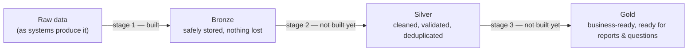

# What this project is

*A plain-language companion to the engineering documentation. If you don't
write code for a living, start here — not in `bronze_layer/README.md` or
`bronze_layer/docs/architecture.md`, which assume a software/data
engineering background.*

## In one sentence

This project is building a pipeline that takes raw data from Ingredion's
operational systems and turns it into clean, trustworthy tables that
reports, dashboards, and (eventually) plain-English questions can be built
on — without an engineer having to hand-build each one.

## The problem this solves

Today, when someone wants a report or needs to investigate why a number
looks wrong, an engineer has to go find the raw data, figure out what
system it came from, clean it up, and build something one-off. That's
slow, it doesn't scale past a handful of requests, and it means business
users are always waiting on engineering time for things that should be
self-serve.

## How the fix works, without the jargon

Think of it as three stages, each one cleaning the data up a bit more:

- **Bronze** — the raw data lands here exactly as the source system sent
  it, nothing reshaped or reinterpreted. If something's wrong with a
  record, it gets set aside ("quarantined") instead of silently breaking
  everything else or getting silently dropped. **This stage is built,
  tested, and running in production today.**
- **Silver** — this is where the data gets cleaned up: business rules
  applied, bad records fixed or filtered, duplicates removed. **Not built
  yet** — it's the next major piece of work, and its design (what it will
  receive from Bronze) is already decided; see `docs/bronze_silver_contract.md`
  if you want the engineering detail.
- **Gold** — business-ready data, aggregated and organized for reporting.
  **Not built yet**, and depends on Silver existing first.

## What "AI" means in this project, specifically

There's an important design decision worth understanding, because it
shapes what's realistic to expect: **AI is planned to advise, not to act.**

A separate, scheduled process is planned to read the pipeline's own
operating history and draft things like: a summary of what changed in the
data today, a flag on data that might be personally identifiable
information, or a plain-language description of a table. All of that gets
reviewed by a person before it affects anything real. AI is explicitly
**not** planned to sit in the path that decides whether data is accepted
or rejected — that decision stays deterministic and rule-based, on
purpose, so it's predictable and testable.

If a future ask changes that — for example, "AI should automatically fix
data problems it finds" — that's a bigger, separate decision that hasn't
been made, and would need to be made deliberately, not assumed.

## Where things stand today

| Capability | Status |
| --- | --- |
| Safely ingest data with nothing lost, bad records set aside automatically | **Live in production** |
| Track every pipeline run (what happened, when, how many records) | **Live in production** |
| Automated testing and checks before any change ships | **Live in production** |
| Handle more source formats beyond the current one | Designed, not built |
| Cleaned/validated data (Silver) | Not started |
| Business-ready reporting data (Gold) | Not started |
| Ask questions in plain English and get answers from the data | Not started — depends on Gold existing first |
| AI-assisted summaries and flags (advisory only, human-reviewed) | Designed, not built — can start now |
| Executive dashboards | Not started — a lower-cost approach (existing Databricks tooling) was already chosen over building something custom; see the note below if that's being revisited |

## How new ideas get in

Business requests don't go straight into engineering work. Every idea gets
written down in `docs/business_requirements.md`, checked against what's
already been decided (so we don't rebuild something that exists, or
quietly reopen a decision that was already made for a reason), and only
becomes actual engineering work once it's scoped and confirmed. This is
deliberate — it's what keeps engineering time going toward things that are
actually needed, in the actually-agreed order, rather than whoever asked
most recently.

**BR-001**, the first entry in that register, is a large platform proposal
that touches almost everything above — some of it already exists, some of
it conflicts with a decision already made (the dashboard tooling choice
mentioned in the table above), and two pieces are genuinely new. It's
still under review; nothing there has been built or committed to yet.

## Who owns what

Yash is the Principal Data Engineer and final reviewer on this project —
every significant decision (what gets built, what gets deployed, what a
business case actually means for the roadmap) goes through that review,
whether the work was drafted by a person or by one of the project's AI
coding assistants.
